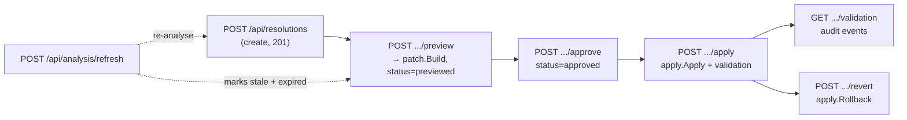

# Module: API

## Purpose
This module is the HTTP surface of the backend: `server.go` builds the whole handler tree (core read endpoints, suggestion generation, history, SPA static serving) and owns the shared response envelopes; `resolutions.go` exposes the Phase 5 resolution lifecycle (create → preview → approve → apply → revert → validation audit) plus analysis refresh; `compare.go` exposes the Phase 4B commit comparison endpoint. All handlers operate on a single run-scoped `*runstate.Run` (plus a bounded `*runstate.History`), return a `{success, data|error}` JSON envelope, and map the typed `resolutions.ErrorCode` values from the safeguard/patch/apply layers onto stable HTTP status codes.

## Files

### `backend/internal/api/server.go`
#### Primary Role
Constructs the `http.Handler` that serves both the JSON API and the built frontend, wires every route group, and implements suggestion generation with request-scoped cancellation. It also contains the response-envelope types and the AI error → HTTP status mapping used across the package.

#### Key Structures
- `type RepositoryMetadata = runstate.RepositoryMetadata` and `type SuggestionItem = runstate.Suggestion` — type aliases so JSON shapes stay identical while storage lives on the run.
- Envelope types: `suggestionsResponse{Success bool; Data []SuggestionItem; Meta *suggestions.Meta}`, `standardResponse{Success, Message, Data}`, `errorResponse{Success bool; Error struct{Code, Message string}}`, `historyResponse{Success; Data []runstate.RunHistory}`, `promptResponse{Success; Data promptcontext.PromptContextIR}`, `promptListResponse{Success; Data []promptcontext.PromptContextIR}`.
- `func writeJSON(w, status, payload)` — sets `Content-Type: application/json` and encodes.
- `func writeError(w, status, code, message)` — emits `{"success":false,"error":{"code":…,"message":…}}`.
- `func StartGraphServer(run *runstate.Run, history *runstate.History, addr string)` — substitutes `runstate.NewRun()` / `runstate.NewHistory(runstate.DefaultHistoryLimit)` for nil arguments, prints `listening on http://localhost<addr>`, and blocks in `http.ListenAndServe`.
- `func NewHandler(run *runstate.Run, history *runstate.History) http.Handler` — exported so tests can exercise the real HTTP interface without a listener (nil run/history get the same defaults).
- `func handleSuggestions(w, r, run, history)` and `func writeSuggestionError(w, err)`.

#### Route list (registered in `NewHandler`)
| Route | Method(s) | Query/Body | Response |
|---|---|---|---|
| `/` | GET | path | static SPA (see below) or plain-text banner |
| `/api/repository` | GET | — | `{success, data: RepositoryMetadata}` |
| `/api/graph` | GET | — | `standardResponse` with `data = run.MergedGraphDTO()` |
| `/api/analysis` | GET | `file` | `{success, data: FileAnalysis}` or `{success, data: []FileAnalysis}`; 404 `ANALYSIS_NOT_FOUND` |
| `/api/prompt` | GET/POST | `file` query, or `{"file":…}` on POST | `promptResponse` / `promptListResponse`; 404 `CONFLICT_NOT_FOUND` |
| `/api/suggestions` | GET | `file` | `suggestionsResponse` (`meta` carries provider/model/runId/counts/failures); see error mapping |
| `/api/history` | GET | — | `historyResponse{data: history.List()}` |
| `/api/graph/expand`, `/api/graph/collapse`, `/api/graph/focus` | any | — | 501 `NOT_IMPLEMENTED` |
| `/api/resolutions*`, `/api/analysis/refresh` | — | — | registered by `registerResolutionHandlers` / `handleAnalysisRefresh` (see `resolutions.go`) |
| `/api/compare` | — | — | registered by `registerCompareHandlers` (see `compare.go`) |

#### Algorithms & Logic
- **SPA static serving with fallback**: when `../frontend/dist` exists, the `/` handler (a) rejects anything under `/api/` with a 404 `NOT_FOUND` JSON error, (b) serves the real file when `filepath.Join(staticPath, filepath.Clean(r.URL.Path))` stats to an existing non-directory, and (c) otherwise falls back to `http.ServeFile(.../index.html)` so client-side routes deep-link correctly. When the dist directory is missing, `/` returns a 200 plain-text banner telling the user to build the frontend.
- **Suggestion generation context**: `handleSuggestions` uses `r.Context()` (not `context.Background()`), so a client disconnect cancels generation and per-request deadlines are honored. If `ctx.Err() == context.Canceled` after generation, the handler returns *without writing a response*; a deadline produces 504 `TIMEOUT`; `file` selects `generator.GenerateForFile(ctx, run, "", file)`, otherwise `GenerateForRun`.
- **Typed AI error → HTTP mapping** (`writeSuggestionError` via `ai.AsError`): `CodeProviderUnavailable`, `CodeModelMissing`, `CodeAPIKeyMissing`, `CodeProviderUnsupported`, `CodeConfigInvalid`, `CodeBaseURLInvalid` → 503 with the `ai.*` code; `CodeTimeout` → 504; any message containing `"no analysis"` → 404 `ANALYSIS_NOT_FOUND`; everything else → 500 `SUGGESTION_ERROR`. AI errors are redacted at construction, so API keys never appear.
- **CORS**: every `/api/*` handler sets `Access-Control-Allow-Origin: *`; the mutating route groups additionally answer `OPTIONS` preflight (see below).

#### Wiring (Dependencies)
- Imports: `CommitIssues/internal/ai` (config + typed errors), `internal/context` (as `promptcontext`, `FileAnalysis`/`PromptContextIR`), `internal/runstate` (run, history, DTOs), `internal/suggestions` (generator + `Meta`); stdlib `context`/`encoding/json`/`errors`/`fmt`/`net/http`/`os`/`path/filepath`/`strings`.
- Imported by: `backend/cmd/serve.go` (calls `api.StartGraphServer(run, history, port)` after scanning conflicts). Test importers: `backend/internal/api/compare_test.go` (`package api_test`, external — imports `CommitIssues/internal/api`); `server_test.go` and `resolutions_test.go` are in-package (`package api`) and therefore do not import it.

### `backend/internal/api/resolutions.go`
#### Primary Role
Phase 5 endpoints for the resolution lifecycle and stale-file recovery, plus the typed-error → HTTP status mapping for the whole resolution stack.

#### Key Structures
- `type mutationRequest struct { ResolutionID string "resolutionId"; RepositoryRoot string "repositoryRoot"; File string "file"; SuggestionRevision int "suggestionRevision"; ExpectedContentHash string "expectedContentHash,omitempty" }` — body of every mutation endpoint; `resolutionId` must repeat the URL path ID.
- `type resolutionResponse struct { Success bool; Data resolutions.Resolution }`.
- `type validationResponse struct { Success bool; Data []resolutions.ResolutionEvent }` — declared in the package (the handler itself uses an anonymous struct that also embeds the validation fields).
- `func registerResolutionHandlers(mux *http.ServeMux, run *runstate.Run)` and `func handleAnalysisRefresh(mux *http.ServeMux, run *runstate.Run)`.
- Handlers: `handleCreateResolution`, `handleGetResolution`, `handleGetValidation`, `handlePreview`, `handleApprove`, `handleApply`, `handleRevert`.
- `func writeResolutionError(w, err)` and `func resolutionHTTPStatus(code resolutions.ErrorCode) int`.

#### Route list with methods, params and JSON shapes
| Route | Method | Query / Request body | Success response |
|---|---|---|---|
| `/api/resolutions` | GET | `file`, `repository` (both optional; `file` alone filters across repos, `file`+`repository` uses `ResolutionsFor`) | `200 {success, data: []Resolution}` |
| `/api/resolutions` | POST | `{suggestionId?, repositoryRoot, file, collisionKey?, revision?, regionId?, replacement?}` | `201` `resolutionResponse` (or `200` with the existing resolution when `suggestionId` already has one) |
| `/api/resolutions/{id}` | GET | — | `200 resolutionResponse`; `404 RESOLUTION_NOT_FOUND` |
| `/api/resolutions/{id}/validation` | GET | — | `200 {success, data: []ResolutionEvent, validationStatus?, validationOutput?, validationExitCode?, validationDuration?}` |
| `/api/resolutions/{id}/preview` | POST | `mutationRequest` | `200 resolutionResponse` with `status=previewed`, `previewDiff` populated |
| `/api/resolutions/{id}/approve` | POST | `mutationRequest` | `200 resolutionResponse` with `status=approved`, `approvalStatus=approved`, `approvedAt` |
| `/api/resolutions/{id}/apply` | POST | `mutationRequest` | `200 {success, data: Resolution, postApplyHash?, validationStatus?}` |
| `/api/resolutions/{id}/revert` | POST | `mutationRequest` + optional `preApplyContent []byte`, `postApplyHash string` | `200 resolutionResponse` with `status=reverted` |
| `/api/analysis/refresh` | POST, OPTIONS | `{repositoryRoot, file}` | `200 {success, message: "analysis refreshed for <file>"}` |

Error envelope everywhere: `writeError` → `{"success":false,"error":{"code","message"}}`. Every route answers `OPTIONS` with `Access-Control-Allow-Methods`/`Access-Control-Headers` and 204; wrong methods get `405 METHOD_NOT_ALLOWED`.

#### Algorithms & Logic
- **Path routing**: the `/api/resolutions/` prefix handler strips the prefix, `SplitN(path, "/", 2)`s into `{id}` + optional action, then dispatches on `method/action` pairs (`GET ""`, `GET "validation"`, `POST "preview"|"approve"|"apply"|"revert"`), otherwise 404 `NOT_FOUND`. All mutation bodies must carry a non-empty `resolutionId` equal to the path ID, plus `repositoryRoot` and `file`, else `400 BAD_REQUEST`.
- **Create** (`handleCreateResolution`): verifies repository + file path through `safeguard`, loads the analysis (`run.GetAnalysis(absRepo, file)`, falling back to `FindAnalysis(file)`), is idempotent per `suggestionId`, defaults `revision` to 1, copies `ContentHash` and the per-region `ContextHash` from the analysis, chooses the initial status `StatusProposed` — or `StatusManualReview` when `!parser.IsSupportedLanguage(file)` or `regionId` is empty — copies `StartLine/EndLine/Base/Ours/Theirs` from the matching `ConflictRegion`, saves, and records `EventProposed`.
- **Preview** rejects `already applied` (403 `ALREADY_APPLIED`) and `stale` (409 `STALE_FILE`) statuses, verifies the suggestion revision when `suggestionRevision != 0`, canonicalizes the repository and compares identity, validates the path, re-verifies the working tree (`safeguard.VerifyWorkingTree`), asserts `expectedContentHash` when supplied, then calls `patch.Build` **read-only**, stores `PreviewDiff`, sets `StatusPreviewed`, and records `EventPreviewed`.
- **Approve** performs the identical repository/path/working-tree/revision checks, then sets `ApprovalApproved`, `StatusApproved`, `ApprovedAt`, and records `EventApproved`.
- **Apply** resolves the analysis snapshot, picks the validation config (`run.GetValidationConfig()` first; otherwise `validation.ConfigFromEnv()` when its allow-list is non-empty, defaulting `RepoRoot`/`WorkDir` to the absolute repository root), and delegates to `apply.Apply(r.Context(), …)`; the response surfaces `postApplyHash` and `validationStatus` alongside the updated resolution.
- **Revert** delegates to `apply.Rollback`, passing through the optional client-supplied `preApplyContent`/`postApplyHash` (server-side snapshot is used when omitted).
- **Refresh** (`/api/analysis/refresh`): for every resolution in `run.ResolutionsFor(absRepo, file)` whose status is `proposed`/`previewed`/`approved`, sets `StatusStale` + `ApprovalExpired` and records `EventStale` with `ActorSystem` (capturing the real previous status); then re-runs `engine.ProcessConflictFile(ctx, run, absRepo, file, engine.DefaultConfig(), false)` (analysis only, no AI) and regenerates suggestions with `suggestions.Generator.GenerateForFile`.
- **Typed-error → HTTP status mapping** (`writeResolutionError` type-switches on `*safeguard.SafeError` and `*patch.PatchError`, anything else → 500 `INTERNAL_ERROR`):

| Error code | HTTP status |
|---|---|
| `RESOLUTION_NOT_FOUND` | 404 |
| `NOT_APPROVED`, `APPROVAL_EXPIRED` | 403 |
| `ALREADY_APPLIED`, `STALE_FILE`, `ROLLBACK_FAILURE`, `APPLY_IN_PROGRESS` | 409 |
| `PATH_ESCAPE`, `REPOSITORY_MISMATCH` | 400 |
| `INVALID_PATCH` | 422 |
| `VALIDATION_FAILURE` | 200 (applied, but validation failed) |
| default | 500 |

- The file ends with `var _ = context.Background` and `var _ = validation.StatusPassed` placeholders that keep those imports referenced.

#### Wiring (Dependencies)
- Imports: `CommitIssues/internal/ai`, `internal/apply` (`Apply`/`Rollback`), `internal/engine` (`ProcessConflictFile`), `internal/parser` (`IsSupportedLanguage`), `internal/patch` (`Build`, `PatchError`), `internal/resolutions` (model/events/codes), `internal/runstate` (store), `internal/safeguard` (all safety checks, `SafeError`), `internal/suggestions` (regeneration), `internal/validation` (`ConfigFromEnv`, status constants); plus `context`/`encoding/json`/`fmt`/`net/http`/`strings`/`time`.
- Imported by: nothing outside the package (it is `package api`); registered from `NewHandler` in `server.go`. Test: `backend/internal/api/resolutions_test.go` (in-package).

### `backend/internal/api/compare.go`
#### Primary Role
Registers the single Phase 4B endpoint `GET|POST /api/compare` that runs a structural three-way commit comparison through `internal/compare` and returns its result, with ref/merge-base failures translated into typed 400-level codes.

#### Key Structures
- `type compareRequest struct { RepositoryRoot string "repositoryRoot"; BaseRef string "baseRef,omitempty"; OursRef string "oursRef"; TheirsRef string "theirsRef" }` — the POST body.
- `func registerCompareHandlers(mux *http.ServeMux, run *runstate.Run)` — closes over the run (registered from `NewHandler`).

#### Algorithms & Logic
- **Preflight**: `OPTIONS` returns 204 with `Access-Control-Allow-Methods: GET, POST, OPTIONS` and `Access-Control-Headers: Content-Type`; any other method than GET/POST → 405 `METHOD_NOT_ALLOWED`.
- **Parameter aliases**: GET reads `repositoryRoot` → `repo` → default `"."`, `base` → `baseRef`, `ours` → `oursRef`, `theirs` → `theirsRef`; POST decodes the JSON body (malformed JSON → 400 `INVALID_REQUEST`) and defaults an empty `repositoryRoot` to `"."`.
- **Validation**: both `ours` and `theirs` refs are required, else 400 `MISSING_REF`.
- **Error mapping** (by message substring of `compare.CompareCommits`'s error): `"failed to resolve merge base"` → 400 `COMPARE_NO_MERGE_BASE`; `"failed to resolve"` or `"not found"` → 400 `COMPARE_REF_INVALID`; anything else → 500 `COMPARE_ERROR`.
- **Success**: `200 {"success": true, "data": *compare.Result}`.

#### Wiring (Dependencies)
- Imports: `CommitIssues/internal/compare` (the actual git/structural comparison), `internal/runstate` (handler registration signature), plus `encoding/json`/`net/http`/`strings`.
- Imported by: nothing outside the package; registered from `NewHandler`. Test importer: `backend/internal/api/compare_test.go` (`package api_test`, external — the only non-test importer besides `cmd/serve.go` that references `CommitIssues/internal/api`).

## Cross-Module Flow
- `cmd/serve.go` scans conflicts, runs `engine.ProcessRepository` into a fresh `runstate.Run`, stores `validation.ConfigFromEnv()` via `run.SetValidationConfig` when an allow-list exists, records a `runstate.RunHistory` entry, then hands both to `api.StartGraphServer` → `NewHandler`.
- `NewHandler` composes the read side (`/api/graph` → `run.MergedGraphDTO()`, `/api/analysis` → `run.FindAnalysis`, `/api/prompt`, `/api/suggestions` → `suggestions.Generator` with `ai.ConfigFromEnv`) with the mutation side registered by `registerResolutionHandlers`, `handleAnalysisRefresh` and `registerCompareHandlers`.
- A client fetches suggestions (`GET /api/suggestions?file=…`), whose items carry `ResolutionID` back-references produced when `suggestions`/`engine` materialized the `resolutions.Resolution`; the client then walks `POST /api/resolutions/{id}/preview → approve → apply → revert`, each handler layering `safeguard` checks on top of `patch.Build` / `apply.Apply` / `apply.Rollback`.
- The handlers translate every typed `*safeguard.SafeError`/`*patch.PatchError` through `resolutionHTTPStatus`, so the frontend sees stable codes (`STALE_FILE` 409, `NOT_APPROVED` 403, `INVALID_PATCH` 422, `VALIDATION_FAILURE` 200) rather than prose.
- Stale recovery is a single round trip: `POST /api/analysis/refresh` invalidates resolutions (`StatusStale` + `ApprovalExpired`), re-runs `engine.ProcessConflictFile`, and regenerates suggestions so the lifecycle can start again with a fresh revision.
- `GET /api/resolutions/{id}/validation` returns the append-only `run.ResolutionEvents(id)` audit trail (sequence-numbered under the run lock) plus the stored validation output/exit code/duration written by `apply.Apply`.

## Tests
- `backend/internal/api/server_test.go` (in-package) — suggestions endpoint behavior through the real handler: success with `meta` (provider/model/counts), 503 for an unavailable provider, 404 `ANALYSIS_NOT_FOUND`, partial failures kept as successes, timeout treated as partial failure rather than 500, no API key leaked in error bodies, history endpoints (empty and recorded runs), and `NewHandler` defaulting nil run/history; it also defines the `fakeOllama` test provider helpers reused by other tests.
- `backend/internal/api/resolutions_test.go` (in-package) — GET a resolution (200) and 404 `RESOLUTION_NOT_FOUND`; the full `preview → approve → apply → validation → revert` workflow (403 `NOT_APPROVED` for apply-before-approval, on-disk bytes updated then restored); mutation safety codes (400 missing `resolutionId`, 400 `PATH_ESCAPE`, 400 `REPOSITORY_MISMATCH`, 409 `STALE_FILE` after an on-disk edit); `/api/analysis/refresh` marking resolutions stale and updating the analysis content hash; an end-to-end suggestions-to-revert run against a fake Ollama provider asserting the audit sequence `previewed → approved → applied → reverted`; and `POST /api/resolutions` proposal creation (201) plus follow-up GET/preview.
- `backend/internal/api/compare_test.go` (`package api_test`) — `/api/compare` contract: 400 `MISSING_REF` without ours/theirs, CORS/OPTIONS preflight, GET and POST success shapes, 400 `COMPARE_REF_INVALID` for a bad ref, and 400 `COMPARE_NO_MERGE_BASE` for orphan branches.
