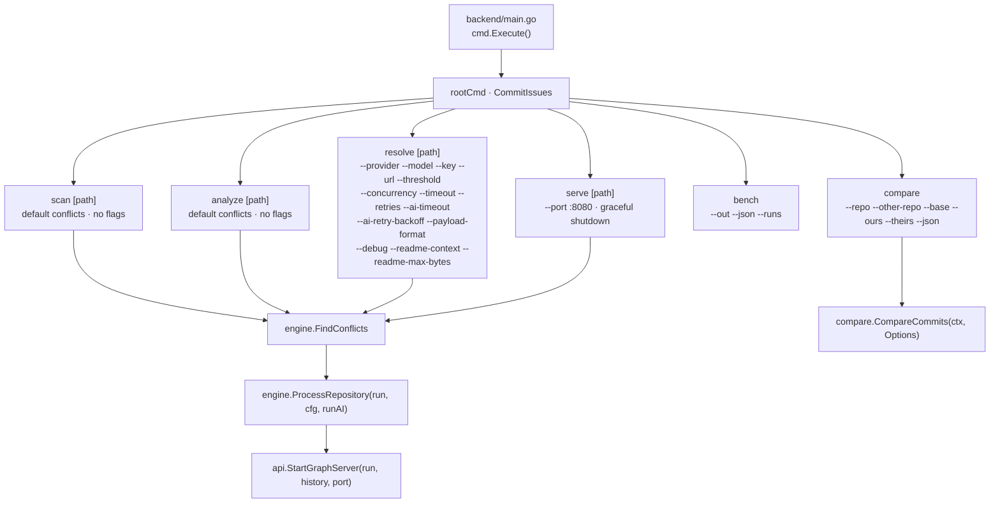

# Module: CLI

## Purpose
The CLI is a thin Cobra layer over the `CommitIssues/internal/engine` pipeline and the HTTP API: `main.go` delegates to `cmd.Execute()`, which runs the `CommitIssues` root command and the six subcommands `scan`, `analyze`, `resolve`, `serve`, `compare` and `bench`. The commands only parse/validate configuration, resolve the scan root, discover conflicted repositories and print results (or start the server) — all analysis, AI and comparison logic lives in the internal packages. Configuration follows the documented precedence **CLI flags > environment variables > provider defaults**, assembled only from explicitly-set flags so nothing is hard-coded and providers/models are never switched silently. A `cli\` folder is referenced by the README but no longer exists in the repository (unused scaffold — see below).

## Files
### `backend/main.go`
#### Primary Role
The binary entry point: seven lines that call `cmd.Execute()`.
#### Key Structures
- `func main()` — `package main`, imports `CommitIssues/cmd` and calls `cmd.Execute()`.
#### Algorithms & Logic
Nothing else: no flag parsing, no configuration.
#### Wiring (Dependencies)
- Imports: `CommitIssues/cmd`.
- Imported by: nothing (it is `package main`); this is the only importer of `CommitIssues/cmd` in the repository (verified by grepping `backend\` for `CommitIssues/cmd`).

### `backend/cmd/root.go`
#### Primary Role
Declares the root Cobra command and the process-level error/exit policy; every subcommand registers itself onto `rootCmd` from its own `init()`.
#### Key Structures
- `var rootCmd = &cobra.Command{ Use: "CommitIssues", Short: "CommitIssues: AST-driven Git merge conflict analyzer and resolver", SilenceUsage: true, SilenceErrors: true }` — usage output is suppressed so structured, machine-parseable failures stay readable.
- `func Execute()` — `rootCmd.Execute()`; on error it prints the error and `os.Exit(1)`.
#### Algorithms & Logic
Subcommand registration happens in package-level `init()` functions (`rootCmd.AddCommand(...)`), so the command tree is fully built before `Execute` runs. Root command declares **no flags**.
#### Wiring (Dependencies)
- Imports: stdlib (`fmt`, `os`) and `github.com/spf13/cobra`.
- Imported by: `backend/main.go` (via `cmd.Execute()`); no test file outside the package.

### `backend/cmd/scan.go`
#### Primary Role
`scan [path]` — lists conflicted files per Git repository; purely AI-free discovery output.
#### Key Structures
- `var scanCmd = &cobra.Command{ Use: "scan [path]", Short: "Scan directory for Git merge conflicts", RunE: … }`.
- **Flags: none.**
#### Algorithms & Logic
Positional path defaults to `conflicts` when no argument is given; `engine.ResolveScanRoot(targetPath)` normalizes it, then `engine.FindConflicts(cmd.Context(), scanRoot)` returns `(map[repoRoot][]file, []repoRoot, error)`. The loop prints `<repo>: No conflicts` or `<repo>: N conflicted file(s)` with one `  - <file>` line each, iterating `repoRoots` in the order discovery returned. Errors are returned to Cobra (printed by `Execute`, exit 1).
#### Wiring (Dependencies)
- Imports: `CommitIssues/internal/engine` (`ResolveScanRoot`, `FindConflicts`), `fmt`, `github.com/spf13/cobra`.
- Imported by: nothing; registered on `rootCmd` in `init()`.

### `backend/cmd/analyze.go`
#### Primary Role
`analyze [path]` — runs the full AST/semantic analysis pipeline over every conflicted repository and prints each file outcome plus the run summary; explicitly AI-free.
#### Key Structures
- `var analyzeCmd = &cobra.Command{ Use: "analyze [path]", Short: "Analyze conflicts, generate AST diffs and JSON reports", RunE: … }`.
- **Flags: none.**
#### Algorithms & Logic
Path defaults to `conflicts`. `cfg := engine.DefaultConfig()` is validated *before* scanning, then `context.WithTimeout(cmd.Context(), cfg.Timeout)` bounds the run. `engine.FindConflicts` returning no repositories prints `No conflicted repositories found.` and succeeds. Otherwise a fresh `runstate.NewRun()` is created and `engine.ProcessRepository(ctx, run, repoRoot, files, cfg, false)` is called per repository with `runAI=false` (AI never invoked); each `RunResult`'s `Outcomes` and `Summary()` are printed and `len(result.Failed)` accumulates. A non-nil `processErr` aborts immediately; at the end any file failures produce `analysis completed with N file(s) failing; see summary above`.
#### Wiring (Dependencies)
- Imports: `CommitIssues/internal/engine`, `CommitIssues/internal/runstate`, stdlib `context`/`fmt`, `github.com/spf13/cobra`.
- Imported by: nothing; registers on `rootCmd` in `init()`.

### `backend/cmd/resolve.go`
#### Primary Role
`resolve [path]` — the CLI AI path: assembles the shared `ai.Config` from flags/env/defaults, validates it, then runs the pipeline with `runAI=true` so collisions are resolved by the configured provider.
#### Key Structures
- `var resolveCmd = &cobra.Command{ Use: "resolve [path]", Short: "Analyze conflicts and use AI to resolve merge collisions", RunE: … }`.
- Package-level flag variables: `apiKey`, `provider`, `modelName`, `baseURL`, `threshold int`, `concurrency int`, `debug bool`, `timeout time.Duration`, `retries int`, `aiTimeout time.Duration`, `readmeContext bool`, `readmeMaxBytes int`.
- `func formatDuration(d time.Duration) string` — `ms` / `s` / `NmNs` rendering for `--debug` timing lines.
- `func buildAIConfigFromFlags(cmd *cobra.Command) ai.Config` — the precedence assembler (see below).
- **All flags** (registered in `init()`; env vars are read through `ai.ConfigFromEnv()` / `engine.DefaultConfig()`, and a flag only wins when explicitly `Changed`):

| Flag | Short | Default | Env var |
| --- | --- | --- | --- |
| `--key` | `-k` | `""` | `AI_API_KEY` |
| `--provider` | `-p` | `""` (help text: default `ollama`) | `AI_PROVIDER` |
| `--model` | `-m` | `""` (help text: `qwen2.5-coder:7b` for ollama) | `AI_MODEL` |
| `--url` | — | `""` | `AI_BASE_URL` |
| `--threshold` | `-t` | `ai.DefaultConfidenceThreshold` = **70** | `AI_CONFIDENCE_THRESHOLD` |
| `--concurrency` | `-c` | **4** (max concurrent files) | — |
| `--timeout` | — | **5m** (`5 * time.Minute`, overall analysis timeout, must be > 0) | — |
| `--retries` | — | `ai.DefaultRetryCount` = **2** | `AI_RETRIES` |
| `--ai-timeout` | — | `ai.DefaultRequestTimeout` = **60s** | `AI_TIMEOUT` |
| `--debug` | — | **false** (verbose resolve pipeline logging) | — |
| `--readme-context` | — | **true** (include repo README excerpt in prompt context) | `AI_README_CONTEXT` |
| `--readme-max-bytes` | — | `engine.DefaultReadmeMaxBytes` = **4096** | `AI_README_MAX_BYTES` |
| `--ai-retry-backoff` | — | `ai.DefaultRetryBackoff` = **500ms** (initial exponential retry backoff) | `AI_RETRY_BACKOFF` |
| `--payload-format` | — | `ai.DefaultPayloadFormat` = **`toon`** (AI payload encoding: `toon` or `json`) | `AI_PAYLOAD_FORMAT` |

#### Algorithms & Logic
- **Config precedence assembly (`flags > env > provider defaults`).** `buildAIConfigFromFlags` starts from `ai.ConfigFromEnv()`; each override is applied only `if flags.Changed(...)` (`provider`, `model`, `url`, `key`, `threshold`, `retries`, `ai-timeout`). The `--provider` branch is special: because `ConfigFromEnv` baked in the Ollama fallbacks when `AI_PROVIDER` was unset, it re-applies the selected provider's defaults for every field the user did not set via environment with `cfg.ApplyProviderDefaults(cfg.Provider)` — so `--provider gemini` gets `gemini-3.5-flash` and Google's endpoint instead of the Ollama model/base URL, while env-set fields and later flags still win.
- **README flags are `Changed`-gated.** `cfg.ReadmeContext` / `cfg.ReadmeMaxBytes` (otherwise taken from `engine.DefaultConfig()`, which itself applies `AI_README_CONTEXT` / `AI_README_MAX_BYTES`) are overwritten only when `--readme-context` / `--readme-max-bytes` were explicitly passed, preserving flags > env > defaults.
- **Payload-format and backoff flags are `Changed`-gated too.** `--ai-retry-backoff` overrides `cfg.RetryBackoff`, and `--payload-format` (lower-cased; validated to `toon|json` by `cfg.AI.Validate()`) overrides `cfg.PayloadFormat` — the encoding used for everything sent to the model (spec TOON by default, JSON as the per-run escape hatch for models that parse it poorly).
- **Threshold unification.** `cfg.ConfidenceThreshold = cfg.AI.ConfidenceThreshold` so the pipeline threshold and the suggestion-status threshold share one source; `cfg.Timeout = timeout`.
- **Validate before scanning.** Both `cfg.Validate()` (MaxConcurrency ≥ 1, Timeout > 0, 0 ≤ threshold ≤ 100) and `cfg.AI.Validate()` run before any work, so invalid settings can never start analysis or deadlock the semaphore.
- **Run loop.** Same shape as `analyze` but with `runAI=true`, plus `engine.EnableDebugLogging(debug)` and `--debug` timing/provider lines (`provider=… model=… threshold=… concurrency=… timeout=… retries=… aiTimeout=…`); no conflicts found prints `No conflicts found to resolve.`; failures produce `resolve completed with N file(s) failing; see summary above`.
#### Wiring (Dependencies)
- Imports: `CommitIssues/internal/ai` (`ConfigFromEnv`, `ApplyProviderDefaults`, defaults, validation), `CommitIssues/internal/engine` (`DefaultConfig`, `ResolveScanRoot`, `FindConflicts`, `ProcessRepository`, `EnableDebugLogging`, `DefaultReadmeMaxBytes`), `CommitIssues/internal/runstate` (`NewRun`), stdlib `context`/`fmt`/`strings`/`time`, `github.com/spf13/cobra`.
- Imported by: nothing; registers on `rootCmd` in `init()`. Its package-level helpers are exercised by `backend/cmd/resolve_test.go`.

### `backend/cmd/serve.go`
#### Primary Role
`serve [path]` — scans and analyzes conflicts once at startup, records the run in bounded in-memory (or opt-in durable) history, then starts the HTTP server that serves the API and (when present) the built frontend. SIGINT/SIGTERM trigger a graceful shutdown that drains in-flight requests.
#### Key Structures
- `var serveCmd = &cobra.Command{ Use: "serve", Short: "Start the interactive AST dependency graph visualization server", RunE: … }`.
- `var port string` — bound by `--port` / `-p`, default **`:8080`** (help: "Port to serve graph web UI").
- `func collisionCountFor(run *runstate.Run, repoRoot string) int` — counts `SmartDiff.Collisions` across the run's analyses for one repository.
- **Flags:** `--port` / `-p` (string, default `:8080`). No AI flags — `serve` stays AI-free.
#### Algorithms & Logic
- Positional path defaults to `../conflicts`.
- `cfg := engine.DefaultConfig()`; `cfg.AI = ai.ConfigFromEnv()` (used **only** for metadata — provider/model shown in run history) and `cfg.Validation = validation.ConfigFromEnv()`; then `cfg.Validate()`.
- `signal.NotifyContext(cmd.Context(), os.Interrupt, syscall.SIGTERM)` yields a cancellable server context (no timeout) that drives `FindConflicts` and `ProcessRepository(..., false)` — no resolver is ever invoked here — and triggers graceful shutdown inside `api.StartGraphServer` (in-flight requests drain up to `api.ShutdownTimeout` = 10s).
- One `runstate.NewRun()` for the server's lifetime; `run.SetValidationConfig(cfg.Validation)` when a validation allow-list is configured; `history := runstate.NewHistoryFromEnv(runstate.DefaultHistoryLimit)` — bounded in-memory (100 entries) by default, or a durable JSON-file-backed store when `HISTORY_PERSIST_PATH` is set (opt-in).
- Repository metadata for the first discovered repo: `Name = filepath.Base(repoRoot)`, `CurrentBranch = git.CurrentBranch(repoRoot)`, `IncomingBranch = git.IncomingBranch(repoRoot)`.
- **History recording on server start**: for each repository a `runstate.RunHistory{RunID: run.ID, Repository: repoRoot, StartedAt: run.StartedAt, Provider, Model}` is enriched (when a `RunResult` exists) with `CompletedAt`, `FilesAnalyzed = len(Succeeded)`, `FailedFiles = len(Failed)`, `CollisionCount`, and one `ErrorSummaries` entry per failed file with a non-nil error; `ctx.Err()` maps to `TimedOut`/`Cancelled`; then `history.Record(entry)` upserts it (evicting the oldest beyond the bound). A repository whose analysis failed only prints a `Warning:` — the server still starts.
- After the analysis loop `run.SetCacheStats(cfg.ASTCache.Stats())` captures AST cache hit/miss/store/eviction counters so `/api/repository` can surface them.
- Finally `api.StartGraphServer(ctx, run, history, port)` blocks serving `/api/*` and static assets until the context is cancelled, then shuts down gracefully.
#### Wiring (Dependencies)
- Imports: `CommitIssues/internal/ai` (`ConfigFromEnv`), `CommitIssues/internal/api` (`StartGraphServer`), `CommitIssues/internal/engine`, `CommitIssues/internal/git` (`CurrentBranch`, `IncomingBranch`), `CommitIssues/internal/runstate`, `CommitIssues/internal/validation` (`ConfigFromEnv`), stdlib `context`/`fmt`/`os`/`os/signal`/`path/filepath`/`syscall`/`time`, `github.com/spf13/cobra`.
- Imported by: nothing; registers on `rootCmd` in `init()`.

### `backend/cmd/bench.go`
#### Primary Role
`bench` — runs the metrics harness in `internal/bench` and writes a dated markdown report plus an optional machine-readable JSON report. It measures JSON-vs-TOON token cost (M1), cold-vs-warm AST cache latency (M2), E2E analyze with/without cache (M3), README pre-context cost (M4), soft-budget trimming (M5) and suggestion reuse (M6); the report header records Go version, OS/arch and git SHA so numbers stay comparable. Reproduce: `go run . bench` (results land in `docs/metrics.md`).
#### Key Structures
- `var benchCmd = &cobra.Command{ Use: "bench", Short: "Run the metrics harness (JSON-vs-TOON, cache, README, budget, reuse)", Long: …, RunE: … }`.
- **Flags:**

| Flag | Type | Default | Purpose |
| --- | --- | --- | --- |
| `--out` | string | `../docs/metrics.md` when cwd has `go.mod`, else `docs/metrics.md` | Markdown report path (empty prints to stdout only) |
| `--json` | string | `""` | Optional path for the JSON report |
| `--runs` | int | `5` | Repetitions for latency-style metrics |
#### Algorithms & Logic
Delegates everything to `bench.Run(bench.Config{Runs, MarkdownOut, JSONOut, Stdout})`; stdout is forced when `--out` is empty. When the markdown report was written it prints `metrics written to <path> at <RFC3339>`; when `--json` was set it prints `raw report written to <path>`.
#### Wiring (Dependencies)
- Imports: `CommitIssues/internal/bench`, stdlib `fmt`/`os`/`path/filepath`/`time`, `github.com/spf13/cobra`.
- Imported by: nothing; registers on `rootCmd` in `init()`.

### `backend/cmd/compare.go`
#### Primary Role
`compare` — compares two commits/branches (or two repositories) *without mutating the working tree*, detecting additions, deletions, renames and binary files, then running AST semantic collision analysis for hypothetical merge conflicts.
#### Key Structures
- `var compareCmd = &cobra.Command{ Use: "compare", Short: "Compare commits or repositories to detect hypothetical merge conflicts", Long: …, RunE: … }` — `Long` includes three examples (`--repo . --ours feature-a --theirs feature-b`, `--repo . --base main …`, `--repo ./repoA --other-repo ./repoB … --json`).
- Package vars: `compareRepo`, `compareOtherRepo`, `compareBase`, `compareOurs`, `compareTheirs string`; `compareJSON bool`.
- **All flags** (registered in `init()`; no env vars):

| Flag | Type | Default | Purpose |
| --- | --- | --- | --- |
| `--repo` | string | `.` | Path to the first repository (current directory) |
| `--other-repo` | string | `""` | Path to a second repository (2-repo mode) |
| `--base` | string | `""` | Base commit/branch; auto-detected (merge base) when omitted |
| `--ours` | string | `""` | Ours commit/branch (**required**) |
| `--theirs` | string | `""` | Theirs commit/branch (**required**) |
| `--json` | bool | `false` | Emit results as indented JSON instead of the text summary |

#### Algorithms & Logic
Validation first: an empty `--ours` or `--theirs` returns `fmt.Errorf("both --ours and --theirs flags are required")`. The flags map 1:1 onto `compare.Options{Repo1, Repo2, BaseRef, OursRef, TheirsRef}` and are passed to `compare.CompareCommits(cmd.Context(), opts)`. Output is either `json.NewEncoder(os.Stdout)` with `SetIndent("", "  ")` (`--json`) or a human-readable report: header (`=== Hypothetical Merge Comparison ===`, repository, `Other Repository` when set, `UNRELATED REPOSITORIES` when `result.UnrelatedRepositories` else `Merge Base`, then `Ours`/`Theirs`), a `Summary:` block of the 12 `compare.Summary` counters (`TotalFiles`, `OursOnly`, `TheirsOnly`, `Identical`, `StructuralCollisions`, `ContentConflicts`, `AddAddConflicts`, `DeleteModifyConflicts`, `RenameConflicts`, `BinaryConflicts`, `Unsupported`, `Errors`), and per-file `File Details:` lines with `Status`, `Explanation` and `Recommendation`.
#### Wiring (Dependencies)
- Imports: `CommitIssues/internal/compare` (`Options`, `CompareCommits`), stdlib `encoding/json`/`fmt`/`os`, `github.com/spf13/cobra`.
- Imported by: nothing; registers on `rootCmd` in `init()`.

### `cli/` (repository root) — **absent; unused scaffold**
#### Primary Role
The README still lists a top-level `cli/` folder as a "Minimal Go CLI module scaffold", but **no such folder exists in the working tree or in `HEAD`**. It never contained executable code and is not part of the build — the real CLI is `backend/main.go` + `backend/cmd`.
#### Key Structures
- None present. Historical contents (retrievable only with `git show`): `cli/LICENSE` (0 bytes), `cli/go.mod` (9 lines declaring `module my-cli`, `go 1.26.3`, requiring cobra/pflag/mousetrap as `// indirect`), `cli/go.sum` (10 lines). **Zero `.go` source files**, so it could never be compiled or run.
#### Algorithms & Logic
None — there is no code. Evidence that it is unused:
- **Not in the working tree or in `HEAD`.** A recursive listing of the repo root shows only `.freebuff\`, `.git\`, `backend\`, `conflicts\`, `docs\`, `frontend\`, `.gitignore` and `README.md`; `git ls-files` matches no `cli` path; `git cat-file -e HEAD:cli` fails with `path 'cli' does not exist in 'HEAD'`.
- **Removed from history.** The three files were added in commit `8fe7374` and deleted in commit `ed0ada8` ("Removed unnecessary files and folders"), which is an ancestor of `HEAD` (`git merge-base --is-ancestor ed0ada8 HEAD` exits 0).
- **Never importable.** Its module path was `my-cli`, not `CommitIssues`, and it had no source files; grepping `backend\` for `CommitIssues/cli` and `"cli"` returns only `internal/resolutions/resolutions.go`'s `ActorCLI = "cli"` (an unrelated audit-actor constant).
- **Documentation agrees it is unused.** `README.md` line 15 calls it a "Minimal Go CLI module scaffold" and line 152 states it "is not required for the main backend/server workflows"; `docs/guide/00_High_Level_Overview.md` line 184 labels it "legacy standalone CLI scaffold (unused by main app)". The README's structure list is stale relative to the current tree.

#### Wiring (Dependencies)
- Imports: none (no code; separate Go module historically, so it could not import `CommitIssues/...` anyway).
- Imported by: nothing.

## Cross-Module Flow
- `main.go` → `cmd.Execute()` → `rootCmd` (subcommands registered by each file's `init()`); any `RunE` error is printed and exits with status 1 (`SilenceUsage`/`SilenceErrors` keep failures machine-parseable).
- `scan` → `engine.ResolveScanRoot` → `engine.FindConflicts(ctx, scanRoot)` → per-repository file listing; no runstate, no AI.
- `analyze` → `engine.DefaultConfig()` + `Validate()` → `context.WithTimeout(cfg.Timeout)` → `runstate.NewRun()` → `engine.ProcessRepository(..., runAI=false)` → printed outcomes/summary; file failures are collected, never fatal per collision (`engine.FileError` per file).
- `resolve` → `buildAIConfigFromFlags` (`ai.ConfigFromEnv()` + `Changed` flags + `ApplyProviderDefaults`) → `cfg.Validate()` + `cfg.AI.Validate()` → `engine.ProcessRepository(..., runAI=true)` → `engine.runAIResolution` → `ai.GetResolver` / `ai.CheckProvider` / `ai.ResolveCollisionWithRetry` → `run.SaveSuggestion` (`complete`/`below_threshold`/`failed`) + `run.SaveResolution` (with `item.ResolutionID`).
- `serve` → `ai.ConfigFromEnv()` (metadata only) + `validation.ConfigFromEnv()` → `runstate.NewRun()` + `runstate.NewHistoryFromEnv(DefaultHistoryLimit)` (durable only via `HISTORY_PERSIST_PATH`) → `ProcessRepository(..., runAI=false)` → one `RunHistory` recorded per repository (timed-out/cancelled flags from `ctx.Err()`) → `api.StartGraphServer(ctx, run, history, port)` with graceful shutdown on SIGINT/SIGTERM; later requests use `suggestions.Generator` (`ai.ConfigFromEnv()`) for `GET /api/suggestions` and `history.List()` for `GET /api/history`.
- `compare` → `compare.CompareCommits(cmd.Context(), compare.Options{...})` → JSON (`--json`) or the text summary; `internal/api/compare.go` reuses the same `runstate.Run` for the HTTP variant of this feature.

## Tests
- `backend/cmd/resolve_test.go` — the only test file in `cmd`; it covers `buildAIConfigFromFlags` precedence with helpers `clearAIEnv` (blanks every `AI_*`/`OLLAMA_BASE_URL` var via `t.Setenv`) and `setFlag` (sets a flag and resets Cobra's `Changed` marker in `t.Cleanup` so state never leaks between tests):
  - `TestBuildAIConfigFromFlags_ProviderAloneWorks` — `--provider` alone (no env) yields that provider's default model/base URL for gemini, groq, ollama, and normalizes uppercase `GEMINI`; every result must pass `cfg.Validate()` (regression: `--provider gemini` used to keep the Ollama model/base URL).
  - `TestBuildAIConfigFromFlags_ExplicitModelWins` — an explicit `--model` beats the provider default.
  - `TestBuildAIConfigFromFlags_EnvModelWins` — `AI_MODEL` beats the provider default but loses to `--model`.
  - `TestBuildAIConfigFromFlags_NoProviderFlagKeepsEnvBehavior` — without `--provider`, `AI_PROVIDER=groq` plus `ai.DefaultGroqModel` behavior is unchanged.
- There are no tests for `scan`, `analyze`, `serve`, `compare` or `root.go`; their behavior is covered indirectly through the `internal/engine`, `internal/api` and `internal/compare` package tests.
