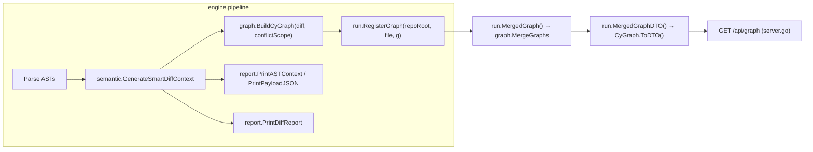

# Module: Graph & Report

## Purpose
These two packages turn the engine's structural analysis into human- and machine-consumable output. `graph` shapes the per-file three-way diff (collisions, our changes, their changes) plus optional semantic call edges into a deterministic, duplicate-free Cytoscape.js element set that the run stores and the `/api/graph` endpoint serves to the frontend. `report` renders the same analysis as plain text — AST summaries, the AI request payload header, and the ordered collision/change sections — into the per-file output buffer produced by the engine pipeline.

## Files

### `backend/internal/graph/graph.go`
#### Primary Role
Builds the Cytoscape JSON graph for one conflicted file (`BuildCyGraph`), merges graphs across files and repositories without duplicates (`MergeGraphs`), and converts to the flat DTO returned by the API (`ToDTO`). Node and edge order is stable regardless of map iteration order, so repeated scans of the same repository produce byte-identical output.

#### Key Structures
- `type CyNodeData struct` — JSON payload of a node: `id`, `label`, `status`, `kind`, `parent,omitempty` (compound-node nesting), `line,omitempty`, `base_code,omitempty`, `our_code,omitempty`, `their_code,omitempty` (the three conflict sides carried for tooltip/detail display).
- `type CyNode struct { Data CyNodeData }`; `type CyEdgeData struct { id, source, target, type }`; `type CyEdge struct { Data CyEdgeData }`.
- `type CyElements struct { Nodes []CyNode; Edges []CyEdge }` and `type CyGraph struct { Elements CyElements }` — the exact on-the-wire Cytoscape shape (`{"elements":{"nodes":[],"edges":[]}}`) used for storage.
- `type GraphDTO struct { Nodes []CyNode "nodes"; Edges []CyEdge "edges" }` — the flattened shape the API actually returns.
- `func BuildCyGraph(repoRoot, fileName string, diff semantic.SmartDiffResult, semanticGraphs ...semantic.SemanticGraph) CyGraph`.
- `func MergeGraphs(graphs []CyGraph) CyGraph`.
- Unexported: `graphFileKey(repoRoot, fileName string) string`, `diffKey(item semantic.DiffItem) string`, `sanitizeID(s string) string`, and method `(g CyGraph) ToDTO() GraphDTO`.

#### Algorithms & Logic
- **Repository-safe keys**: `graphFileKey` returns `repoRoot + "|" + fileName` (empty root → bare file name), mirroring `runstate.FileKey`, so identical relative paths in different repositories get distinct root/node IDs; `sanitizeID` maps `/ \ : .` and spaces to `_` so IDs are safe as Cytoscape element IDs.
- **Root node first**: the first node is `"file__" + sanitizeID(graphFileKey(...))` with `kind/status = "file"` and `label = fileName`; the `appendNode` closure dedupes on `Data.ID` via a `seenNodeIDs` set, so a repeated key can never add a second node.
- **Status map with precedence**: `statusMap` is keyed by `diffKey(item)` (`item.Identity` when present, else `strings.ToLower(kind) + ":" + name`). Collisions are inserted first with `status = "collision"`, then `OurChanges`, then `TheirChanges` — the latter two only when the key is not already present, so a collision always wins and our/their entries never duplicate it. Their status is `strings.ToLower(item.Type)` (e.g. `added`, `updated`, `deleted`) and the item's `BaseContent`/`OurContent`/`TheirContent` are copied onto the node.
- **Deterministic children**: the map keys are collected and `sort.Strings`-ed, then each child node is emitted with `ID = sanitizeID(rootID + "__" + key)`, `Parent = rootID` (Cytoscape compound node), `Label = fmt.Sprintf("%s: %s (L%d)", kind, name, line)`.
- **Semantic edges (optional)**: when `semanticGraphs` is non-empty only `semanticGraphs[0]` is used; semantic nodes are mapped to Cytoscape node IDs by `node.Identity` (falling back to `strings.ToLower(kind) + ":" + name`), only edges of `Type == "CALLS"` survive, both endpoints must have mapped (unmapped ones are silently skipped), edge IDs are `sanitizeID`-ed and deduped with `seenEdgeIDs`, and the final edge slice is `sort.Slice`d by `Data.ID`.
- **Merge**: `MergeGraphs` walks every graph in order, appends nodes/edges whose IDs have not been seen, then sorts both slices by `Data.ID` — the union is deterministic, duplicate-free and independent of registration order.

#### Wiring (Dependencies)
- Imports: `CommitIssues/internal/semantic` (`SmartDiffResult`, `DiffItem`, `SemanticGraph`) plus `fmt`/`sort`/`strings`.
- Imported by (verified): `internal/runstate/runstate.go` (the `graphs map[string]graph.CyGraph` field, `RegisterGraph` keyed by `FileKey`, `MergedGraph` → `MergeGraphs`, `MergedGraphDTO` → `ToDTO`) and `internal/engine/pipeline.go` (`graph.BuildCyGraph(repoRoot, fileName, smartDiff, conflictScope)` when registering the analysis). Test importers: `internal/runstate/runstate_test.go`, `internal/runstate/isolation_test.go` (plus the in-package `internal/graph/graph_test.go`).

### `backend/internal/report/report.go`
#### Primary Role
Plain-text rendering helpers for the analysis pipeline: AST summaries per side, the AI request payload banner, filename-safe report files, and the ordered smart-diff report (collisions → our changes → their changes) that ends up in each `FileOutcome.Output`.

#### Key Structures
- `func PrintASTContext(w io.Writer, label string, data parser.ASTContext)` — prints `--- <label> AST DATA ---`, then a `Functions:` list (`- <name> (Line <n>)`, or `- (none)`), then a `Variables:` list in the same form.
- `func PrintPayloadJSON(w io.Writer, payload prompt.AIRequestPayload, jsonBytes []byte)` — prints only the banner `--- AI REQUEST PAYLOAD (TOON) ---`; `payload` and `jsonBytes` are not written.
- `func SaveReportFile(jsonBytes []byte, repoRoot, fileName string) (string, error)` — `os.MkdirAll("reports", 0755)`, writes `reports/<Sanitize(repoRoot)>__<Sanitize(fileName)>.report.json` with mode `0644`, returns the path.
- `func SanitizeForFilename(s string) string` — replaces `/ \ : space .` with `_`.
- `func SummarizeContent(content string) string` — `"(empty)"` for empty input; otherwise collapses all whitespace runs to single spaces and truncates to 100 bytes with `"..."`.
- `func PrintDiffReport(w io.Writer, result semantic.SmartDiffResult)` — the top-level report.
- `func PrintCollisionSection(w io.Writer, items []semantic.DiffItem)` and `func PrintChangeSection(w io.Writer, title string, items []semantic.DiffItem)`.

#### Algorithms & Logic
`PrintDiffReport` renders in a fixed order: a `=`×80 banner, the title `SMART 3-WAY STRUCTURAL ANALYSIS`, a one-line count summary `Collisions: N | Our changes: N | Their changes: N`, the `=`×80 banner again, then `PrintCollisionSection(result.Collisions)`, `PrintChangeSection(w, "OUR CHANGES (Safe to Apply)", result.OurChanges)`, and `PrintChangeSection(w, "THEIR CHANGES (Safe to Apply)", result.TheirChanges)`.

`PrintCollisionSection` prints `No collisions found.` when empty; otherwise a `COLLISIONS (Need AI or manual review)` header and, per item (1-based), `[i] <Kind> - <Name> (Line <n>)` followed by indented `Base`, `Ours` and `Theirs` summaries through `SummarizeContent`.

`PrintChangeSection` prints the title (or `  - (none)` when empty) and per item chooses the "new" content by title: `OurContent` for our changes, `TheirContent` when `title == "THEIR CHANGES (Safe to Apply)"`. It then switches on `c.Type`: `ADDED` → `New content : …`; `UPDATED` → `Before : <BaseContent>` plus `After : <new>`; `DELETED` → `Removed content : <BaseContent>`.

#### Wiring (Dependencies)
- Imports: `CommitIssues/internal/parser` (`ASTContext`), `internal/prompt` (`AIRequestPayload`), `internal/semantic` (`SmartDiffResult`, `DiffItem`); plus `fmt`/`io`/`os`/`path/filepath`/`strings`.
- Imported by (verified): `internal/engine/pipeline.go` only — `PrintASTContext` (OUR/THEIR AST dumps), `PrintPayloadJSON` (after marshaling the AI payload), `PrintDiffReport` (after graph/analysis registration). `SaveReportFile` currently has no callers (the pipeline stores marshaled bytes via `run.SaveReport` instead).
- **Note:** `backend/internal/report` has no `_test.go` file.

## Cross-Module Flow
- `engine.ProcessConflictFile` computes `smartDiff := semantic.GenerateSmartDiffContext(...)`, then `semantic.BuildSemanticGraph`/`MergeSemanticGraphs`/`ComputeConflictScope` and calls `run.RegisterGraph(repoRoot, fileName, graph.BuildCyGraph(repoRoot, fileName, smartDiff, conflictScope))` — the variadic semantic graph supplies `CALLS` edges between collision nodes.
- `run.RegisterGraph` stores under `runstate.FileKey(repoRoot, file)`, replacing any prior graph for that pair, so re-scans never duplicate nodes; `run.MergedGraph()` unions all stored graphs through `graph.MergeGraphs` and `run.MergedGraphDTO()` flattens via `CyGraph.ToDTO()`.
- `api.StartGraphServer`/`NewHandler` serve that DTO at `GET /api/graph` as `standardResponse{success, message, data}`, which the frontend renders as Cytoscape compound nodes (file root → per-element children carrying `base_code`/`our_code`/`their_code`).
- In the same pipeline pass, `report.PrintASTContext`, `report.PrintPayloadJSON` and `report.PrintDiffReport` stream into the file's `bytes.Buffer`, becoming the `FileOutcome.Output` returned by the engine and shown in the CLI/`serve` logs.
- Determinism is the contract across layers: sorted diff keys in `BuildCyGraph`, sorted IDs in `MergeGraphs`, and ID-keyed storage in `runstate` mean repeated scans of identical input yield byte-identical `/api/graph` payloads (asserted by `TestBuildCyGraph_StableAcrossRepeatedScans`).

## Tests
- `backend/internal/graph/graph_test.go` — `BuildCyGraph` produces identical node/edge order on repeated builds, no duplicate node or edge IDs, the file root is the first node, merging a graph with itself does not duplicate elements, `MergeGraphs` sorts merged node IDs, and merging nothing yields empty slices.
- `backend/internal/runstate/runstate_test.go` and `backend/internal/runstate/isolation_test.go` (test importers of `internal/graph`) — `TestRun_RepeatedGraphScanDoesNotDuplicateNodes`, `TestRun_MergedGraphIsSorted`, `TestRun_GraphIDsAreRepositorySafe`, and `TestRun_MergedGraphDeterministicAcrossRegistrationOrder` cover run-side registration and merging of `graph.CyGraph` values.
- `backend/internal/report` — no test file exists; its output is exercised indirectly wherever engine pipeline tests capture `FileOutcome.Output`.
