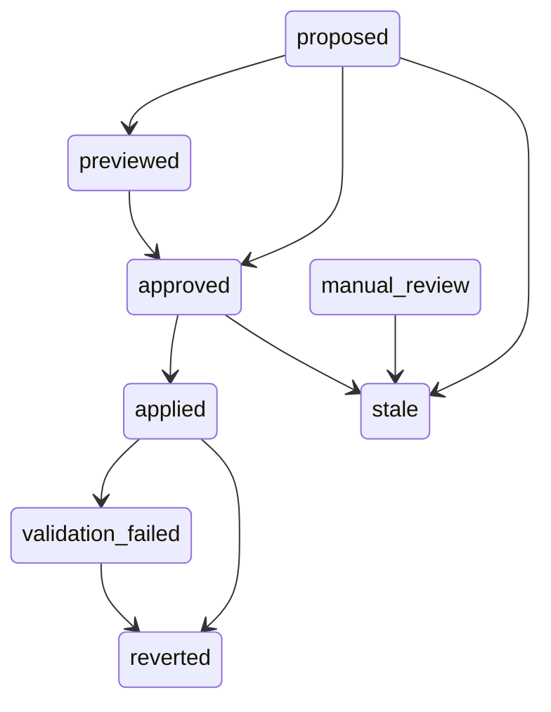

# Module: Resolutions

## Purpose
This module is the "safe apply stack" that turns an AI-generated suggestion into a guarded, auditable mutation of the working tree. `resolutions` defines the dependency-free data model (lifecycle statuses, approval/validation states, immutable audit events, stable error codes); `fileutil` supplies the shared primitives (SHA-256 hashing, region-context hashing, path containment, atomic writes); `patch` builds read-only previews and validates region replacements; `safeguard` enforces pre-apply invariants (repository identity, path safety, staleness hashes, approval, revision); `validation` runs allow-listed post-apply commands; and `apply` orchestrates the whole workflow including atomic write and snapshot rollback. The layering is strictly downward: `resolutions`/`fileutil` have no internal dependencies, `patch`/`safeguard`/`validation` sit in the middle, and `apply` sits on top — no import cycle can form with `internal/runstate`, which stores the mutable state.

## Files

### `backend/internal/resolutions/resolutions.go`
#### Primary Role
The Phase 3 resolution data model: one patch proposal linked to a single run-scoped suggestion, plus the immutable audit events for its lifecycle. The package holds only data, statuses, identifiers and the stable error-code contract — no internal imports — so all mutable, run-scoped state lives in `internal/runstate`, which imports this package (never the reverse).

#### Key Structures
- **Lifecycle statuses** (string constants): `StatusProposed` (`"proposed"`), `StatusPreviewed` (`"previewed"`), `StatusApproved` (`"approved"`), `StatusApplied` (`"applied"`), `StatusReverted` (`"reverted"`), `StatusStale` (`"stale"`), `StatusFailed` (`"failed"`), `StatusValidationFailed` (`"validation_failed"`), `StatusManualReview` (`"manual_review"`).
- **Approval statuses**: `ApprovalNone` (`"none"`), `ApprovalApproved` (`"approved"`), `ApprovalExpired` (`"expired"`) — approval is explicit and expires when the source file, conflict region, repository identity or suggestion revision changes.
- **Validation statuses**: `ValidationNotRun`, `ValidationRunning`, `ValidationPassed`, `ValidationFailed` (the applied change is preserved — never reverted automatically), `ValidationTimedOut`, `ValidationCancelled`.
- **Audit event types** (immutable once recorded): `EventProposed`, `EventPreviewed`, `EventApproved`, `EventApplyStarted`, `EventApplied`, `EventValidationStarted`, `EventValidationPassed`, `EventValidationFailed`, `EventRevertStarted`, `EventReverted`, `EventStale`, `EventFailed`. **Actors**: `ActorUser`, `ActorCLI`, `ActorSystem`.
- `type ErrorCode string` — the stable API contract the frontend maps to user-facing states: `CodeResolutionNotFound` (`RESOLUTION_NOT_FOUND`), `CodeNotApproved` (`NOT_APPROVED`), `CodeAlreadyApplied` (`ALREADY_APPLIED`), `CodeStaleFile` (`STALE_FILE`), `CodeInvalidPatch` (`INVALID_PATCH`), `CodePathEscape` (`PATH_ESCAPE`), `CodeRepositoryMismatch` (`REPOSITORY_MISMATCH`), `CodeApprovalExpired` (`APPROVAL_EXPIRED`), `CodeValidationFailure` (`VALIDATION_FAILURE`), `CodeRollbackFailure` (`ROLLBACK_FAILURE`), `CodeApplyInProgress` (`APPLY_IN_PROGRESS`), `CodeInvalidTransition` (`INVALID_TRANSITION`).
- `type Resolution struct` — the proposal record: identity (`ID`, `SuggestionID` = `<repository>|<file>|<collisionKey>`, `RunID`, `Repository`, `File`, `CollisionKey`, `Revision`), region identity (`RegionID`, `StartLine`/`EndLine`, `StartOffset`/`EndOffset`), staleness/snapshot hashes (`ContentHash` at analysis time, `OriginalContentHash` pre-apply, `ContextHash`, `PostApplyHash`, `PostApplyContentHash`), stored region contents (`Base`, `Ours`, `Theirs`), `Replacement`, read-only `PreviewDiff`, rollback snapshot `PreApplyContent`, the status triple (`Status`, `ApprovalStatus`, `ValidationStatus`), validation results (`ValidationOutput`, `ValidationExitCode`, `ValidationDuration`), timestamps (`CreatedAt`, `ApprovedAt`, `AppliedAt`, `RevertedAt`), and the last failure (`ErrorCode`, `ErrorMessage`).
- `type ResolutionEvent struct` — one immutable audit record: `Sequence` (run-wide monotonic, assigned by the store under its lock), `ResolutionID`, `RunID`, `Repository`, `File`, `Timestamp`, `Actor`, `Type`, `PreviousStatus`, `NewStatus`, `ErrorCode`.
- `func NewID() string` — 16 `crypto/rand` bytes hex-encoded to 32 lowercase hex characters; falls back to `fmt.Sprintf("res%016x", time.Now().UTC().UnixNano())` if `crypto/rand` fails. Never contains `/`, `\`, `:`, `|`, `?`, `#`, `%` or spaces, so IDs embed safely in `/api/resolutions/{id}` without leaking Windows paths.
- `func ValidateTransition(fromStatus, toStatus string) error` — lifecycle guard used before rollback (see below).

#### Algorithms & Logic
`ValidateTransition` encodes the legal edges as a static adjacency map (a transition to the same status is always allowed): `proposed → {previewed, approved, stale, failed, manual_review}`; `previewed → {approved, stale, failed, manual_review}`; `approved → {previewed, applied, stale, failed}`; `applied → {validation_failed, reverted, failed}`; `validation_failed → {reverted, failed}`; `manual_review → {stale, failed}`. `stale`, `failed` and `reverted` have no outgoing edges (terminal), and `proposed`/`previewed` can never jump straight to `applied` — approval is a hard gate. On violation the function returns a plain `fmt.Errorf("invalid lifecycle transition from %s to %s", ...)`; callers such as `apply.Rollback` wrap that error into a typed `*safeguard.SafeError` with `CodeRollbackFailure`.

#### Wiring (Dependencies)
- Imports: stdlib only (`crypto/rand`, `encoding/hex`, `fmt`, `time`) — zero internal dependencies by design.
- Imported by (verified with ripgrep over `backend\`): non-test — `internal/patch/patch.go`, `internal/apply/apply.go`, `internal/validation/validation.go`, `internal/safeguard/safeguard.go`, `internal/runstate/runstate.go`, `internal/runstate/resolutions.go`, `internal/suggestions/suggestions.go`, `internal/engine/pipeline.go`, `internal/api/resolutions.go`. Test importers — `patch_test.go`, `apply_test.go`, `safeguard_test.go`, `suggestions_test.go`, `runstate/resolutions_test.go`, `api/resolutions_test.go`.

### `backend/internal/patch/patch.go`
#### Primary Role
Builds read-only unified diffs and validates proposed replacements for a single conflict region. It never writes to disk: preview produces the proposed content purely in memory, modifies only the selected region of multi-region files (all others preserved byte-for-byte), and returns `INVALID_PATCH` instead of guessing when a replacement cannot be safely mapped.

#### Key Structures
- `type PatchError struct { Code resolutions.ErrorCode; Message string }` — typed error; `Error()` renders `"CODE: message"`.
- Sentinels (all `*PatchError`): `ErrInvalidPatch` (`CodeInvalidPatch`), `ErrStaleFile` (`CodeStaleFile`), `ErrAmbiguousRegion` (`CodeInvalidPatch`, zero or multiple region matches).
- `type PreviewResult struct { ProposedContent, UnifiedDiff, OriginalContent string; RegionIndex int; RequiresManualReview bool }` — outcome of a read-only build; `RegionIndex` is the 0-based index of the replaced region; `RequiresManualReview` is true for unsupported languages.
- `func Build(analysis promptcontext.FileAnalysis, res resolutions.Resolution, currentData []byte) (PreviewResult, error)` — the single entry point; `res.RegionID` is `fmt.Sprintf("%d", region.Index)` and `currentData` is the working-tree bytes already read by the caller.
- Unexported helpers: `findRegion`, `applyRegionReplacement`, `buildUnifiedDiff`.

#### Algorithms & Logic
`Build` runs an 8-step pipeline:
1. **Content-hash check** — `fileutil.HashContent(currentData)` must equal `analysis.ContentHash` (when set), else `ErrStaleFile`.
2. **Region location** — `findRegion` matches `RegionID` against `fmt.Sprintf("%d", r.Index)`; an empty ID or zero matches returns `ErrAmbiguousRegion`, more than one match returns `INVALID_PATCH`.
3. **Region context-hash check** — recomputes `fileutil.RegionContextHash(allLines, region)` over the current bytes and compares with `analysis.RegionContextHashes[res.RegionID]`; mismatch → `ErrStaleFile`.
4. **Replacement sanity** — a whitespace-only replacement → `ErrInvalidPatch`.
5. **Region splice** — `applyRegionReplacement` replaces lines `[StartLine, EndLine]` (1-based inclusive) and preserves everything else, including the trailing-newline behavior of the original. It rejects: replacements containing `<<<<<<<`/`=======`/`>>>>>>>`; whole-file replacements when the file has content outside the region; out-of-bounds ranges; regions whose first line no longer starts with `<<<<<<<` or whose last line no longer starts with `>>>>>>>` (so unrelated content is never blindly overwritten).
6. **Other-region preservation** — every other conflict region's original text must still appear verbatim inside the proposed content, otherwise `INVALID_PATCH` ("patch modified or corrupted other conflict region N").
7. **Syntax check** (supported languages only) — before calling `parser.ParseAndCheckSyntax(res.File, ...)`, all *other* conflict regions in the proposed text are temporarily collapsed to their `Ours` content, so leftover conflict markers in untouched regions do not trigger false positives; a parse failure → `INVALID_PATCH`. Unsupported languages skip the check and set `RequiresManualReview: !isSupported`.
8. **Unified diff** — `buildUnifiedDiff` is a dependency-free, LCS-free line comparison that opens a hunk with 3 lines of leading context, appends changed lines, and flushes a hunk once more than 3 trailing unchanged lines accumulate; hunk headers use 1-based starts. (The `sb.Len() == 0 → "(no changes)"` branch is unreachable in practice because the `--- a/…` / `+++ b/…` headers are written first.)

#### Wiring (Dependencies)
- Imports: `CommitIssues/internal/context` (`FileAnalysis` snapshot), `internal/fileutil` (hashing), `internal/git` (`ConflictRegion`), `internal/parser` (language support + syntax check), `internal/resolutions` (typed error codes).
- Imported by: `internal/apply/apply.go`, `internal/api/resolutions.go`. Test importer: `internal/patch/patch_test.go` (same package).

### `backend/internal/apply/apply.go`
#### Primary Role
Phase 6 (safe atomic application) and Phase 7 (rollback) of the resolution lifecycle: per-resolution in-flight locking, re-validation of file/repository/status/approval/revision, pre-apply snapshot, in-memory patch build, atomic write, post-apply hash verification, audit events, optional post-apply validation, and a rollback that refuses to clobber unrelated user edits — never `git reset --hard`.

#### Key Structures
- `type ApplyRequest struct { ResolutionID, RepositoryRoot, File string; SuggestionRevision int; ExpectedContentHash string }` — every field is required by the API handler; `ExpectedContentHash`, when non-empty, must match the working-tree hash.
- `type ApplyResult struct { Resolution resolutions.Resolution; ValidationResult *validation.Result; PostApplyHash string }`.
- `func Apply(ctx context.Context, run *runstate.Run, analysis promptcontext.FileAnalysis, req ApplyRequest, validationCfg *validation.Config) (ApplyResult, error)` — the full apply workflow (below).
- `type RollbackRequest struct { ResolutionID, RepositoryRoot, File string; PreApplyContent []byte; PostApplyHash string }` — both optional fields fall back to the server-side snapshot stored on the resolution.
- `func Rollback(ctx context.Context, run *runstate.Run, req RollbackRequest) (resolutions.Resolution, error)`.

#### Algorithms & Logic
`Apply` executes the mandated 10-step workflow:
1. `run.TryBeginResolutionApply(id)` — a non-blocking per-resolution lock; if busy, returns `CodeApplyInProgress`; always paired with `defer run.EndResolutionApply`.
2. Load the resolution (`CodeResolutionNotFound`) and run `safeguard.VerifyStatus`, `safeguard.VerifyApproval`, `safeguard.VerifyRevision`.
3. `safeguard.VerifyRepository` (canonicalize), `VerifyRepositoryIdentity` (stored vs. current root), `VerifyFilePath` (containment).
4. `safeguard.VerifyWorkingTree` (content hash, region existence, region-context hash) plus the optional caller `ExpectedContentHash` assertion (`CodeStaleFile` on mismatch).
5. Record the `apply_started` audit event (`ActorUser`, `NewStatus: StatusApplied`).
6. `patch.Build(...)` in memory — on failure the resolution becomes `StatusFailed` with `INVALID_PATCH` and an `EventFailed` record (previous status `approved`).
7. `fileutil.AtomicWrite(absPath, ProposedContent, perm)` — permissions are taken from `os.Stat` of the target (default `0o644`); a write failure records the same failed event.
8. Post-apply verification — re-hash the file and compare with `fileutil.HashContent([]byte(ProposedContent))`; a mismatch (concurrent modification) marks the resolution failed. A hash-read error is non-fatal (`postHash = ""`).
9. Persist `StatusApplied`, `AppliedAt`, `PreApplyContent = OriginalContent`, `OriginalContentHash`, `PostApplyHash`/`PostApplyContentHash`, then record `EventApplied`.
10. Validation — only when `validationCfg != nil && len(validationCfg.AllowList) > 0`: build a `validation.NewRunner`, record `validation_started`, and run `Command[0]/Command[1:]` (falling back to `AllowList[0]` when `Command` is empty). A non-passing result sets `StatusValidationFailed` plus `ValidationFailed`/`ValidationTimedOut`/`ValidationCancelled`, stores `ValidationOutput`/`ValidationExitCode`/`ValidationDuration`, and records `validation_failed` (with `VALIDATION_FAILURE` in the event) — **the applied change is never reverted automatically**. With no configuration the resolution gets `ValidationNotRun`.

`Rollback` executes: (1) `TryBeginResolutionRevert` (which reuses the apply in-flight tracker) → `APPLY_IN_PROGRESS` when busy; (2) load resolution; (3) `resolutions.ValidateTransition(res.Status, StatusReverted)` — any invalid state → `ROLLBACK_FAILURE`; (4) `VerifyRepository` + `VerifyFilePath`; (5) resolve `postApplyHash` (request → `PostApplyContentHash` → `PostApplyHash`) and `preApplyContent` (request → `res.PreApplyContent`; missing → `ROLLBACK_FAILURE`); (6) if a post-apply hash is known, re-hash the current file and **refuse** (`ROLLBACK_FAILURE`) when it differs, because that means unrelated user edits happened after apply; (7) record `revert_started`; (8) `fileutil.AtomicWrite` the stored pre-apply content (failure → `StatusFailed` + `EventFailed` with `ROLLBACK_FAILURE`); (9) set `StatusReverted`, `RevertedAt`, and record `EventReverted`.

#### Wiring (Dependencies)
- Imports: `internal/context` (analysis snapshot), `internal/fileutil` (atomic write/hash), `internal/patch` (build), `internal/resolutions` (model/events/codes), `internal/runstate` (storage, in-flight locks, audit log), `internal/safeguard` (all pre-apply checks), `internal/validation` (post-apply runner), plus `context`/`fmt`/`os`/`time`.
- Imported by: `internal/api/resolutions.go` (the `apply`/`revert` handlers). Tests: `internal/apply/apply_test.go` (same package).

### `backend/internal/validation/validation.go`
#### Primary Role
Runs user-configured post-apply validation commands under strict constraints: commands must come from an explicit allow-list (never from AI output), the working directory is confined to the repository root, the environment is sanitized, every run has a timeout and is cancellable, output is captured and size-limited, and a failure never automatically reverts the applied change.

#### Key Structures
- Status constants mirroring `resolutions`: `StatusNotRun`, `StatusRunning`, `StatusPassed`, `StatusFailed`, `StatusTimedOut`, `StatusCancelled` (assigned from `resolutions.Validation*`).
- `DefaultTimeout = 2 * time.Minute`; `DefaultOutputLimit = 1 << 20` (1 MiB).
- `type Config struct { AllowList, Command []string; WorkDir, RepoRoot string; Timeout time.Duration; OutputLimit int; Env []string }` — empty `AllowList` means validation is disabled; empty `Command` means `AllowList[0]` is executed; empty `Env` means the sanitized environment.
- `func ConfigFromEnv() Config` — reads `VALIDATION_ALLOWLIST` (split on `,`, space, `;`), `VALIDATION_COMMAND` (whitespace-split), `VALIDATION_TIMEOUT` (`time.ParseDuration`, positive only), `VALIDATION_OUTPUT_LIMIT` (positive int).
- `type Result struct { Status string; ExitCode int; Output string; Duration time.Duration; ErrorMessage string }`.
- `type Runner struct { cfg Config }` with `func NewRunner(cfg Config) (*Runner, error)` (requires non-empty `RepoRoot`; defaults `WorkDir`→`RepoRoot`, `Timeout`→`DefaultTimeout`, `OutputLimit`→`DefaultOutputLimit`).
- `func (r *Runner) Run(ctx context.Context, command string, args []string) Result` — the executor; unexported helpers `isAllowed`, `buildEnv`, `outputLimit`, `baseName`, `truncate`, and `type limitedWriter`.

#### Algorithms & Logic
- **Command allow-listing**: `Run` refuses before spawning when `!isAllowed(command)`, returning `StatusFailed`, `ExitCode: -1`, and a `"… is not in the allow-list"` message. `isAllowed` compares the *base name* of the command against the base name of every allow-list entry (or an exact match), so `go`, `/usr/local/go/bin/go` and `C:\Go\bin\go.exe` all satisfy an entry of `go`; `baseName` splits on both `/` and `\` and strips `.exe`. An empty allow-list always denies.
- **Execution**: `context.WithTimeout(ctx, cfg.Timeout)` wraps the caller's context; `exec.CommandContext` runs with `cmd.Dir = cfg.WorkDir` and `cmd.Env = cfg.buildEnv()`. `buildEnv` uses `cfg.Env` verbatim when set, otherwise emits a minimal `["PATH=" + os.Getenv("PATH")]` (with a POSIX fallback path) to prevent credential leakage — no `HOME`, `USER`, etc.
- **Output limiting**: stdout and stderr share one `limitedWriter`; bytes past `OutputLimit` are silently dropped (`truncated` is set and all bytes are still reported as consumed to avoid spurious write errors), then `"\n[output truncated at N bytes]"` is appended.
- **Status classification**: `err == nil` → `StatusPassed` (exit 0); `ctx.Err() == context.DeadlineExceeded` → `StatusTimedOut`; other `ctx.Err()` → `StatusCancelled` (both with `ExitCode: -1`); otherwise `StatusFailed` with the real `exec.ExitError.ExitCode()` (or `-1`).
- The unexported `truncate` helper (clip + notice) currently has no call sites — `Run` applies the truncation notice itself.

#### Wiring (Dependencies)
- Imports: `CommitIssues/internal/resolutions` (status constants), plus `bytes`/`context`/`fmt`/`os`/`os/exec`/`strings`/`time`.
- Imported by: `cmd/serve.go` (`validation.ConfigFromEnv` at startup), `internal/engine/config.go`, `internal/runstate/runstate.go`, `internal/runstate/resolutions.go` (`validation.Config` stored per run), `internal/apply/apply.go`, `internal/api/resolutions.go`. Test importer: `internal/apply/apply_test.go`.

### `backend/internal/safeguard/safeguard.go`
#### Primary Role
Pre-apply safety checks (Phase 4): repository root canonicalization and identity verification, file-path validation against traversal/Windows drive escapes, working-tree content and conflict-region context-hash comparison, and suggestion revision/approval/status verification. Every failure is a typed `*SafeError` carrying a stable `resolutions.ErrorCode`, so the API layer can return exact machine-readable codes.

#### Key Structures
- `type SafeError struct { Code resolutions.ErrorCode; Message string }` with `Error()` → `"CODE: message"`; unexported constructor `safeErr(code, format, args...)`.
- `func VerifyRepository(repoRoot string) (string, error)` — non-empty, `filepath.Abs`, must exist and be a directory; else `CodeRepositoryMismatch`.
- `func VerifyRepositoryIdentity(storedRoot, currentRoot string) error` — canonicalizes and `filepath.Clean`s both sides (so `C:\foo` == `C:/foo`), compares, else `CodeRepositoryMismatch`.
- `func VerifyFilePath(repoRoot, relFile string) (string, error)` — rejects empty paths, NUL bytes, absolute paths (`filepath.IsAbs`), embedded Windows drive letters (`looksLikeWindowsDrive`, checked regardless of OS), `..` prefixes after `filepath.Clean`, and finally any Join+Clean result that escapes the root (via `fileutil.AbsFilePath`); all → `CodePathEscape`.
- `type WorkingTreeCheck struct { CurrentData []byte; CurrentHash string; Regions []git.ConflictRegion }`.
- `func VerifyWorkingTree(absPath string, analysis promptcontext.FileAnalysis, regionID string) (WorkingTreeCheck, error)` — 4 checks: file readable; current SHA-256 == `analysis.ContentHash` (when set); the region with `fmt.Sprintf("%d", index) == regionID` still exists after re-parsing via `git.ParseConflictRegions`; and the recomputed `fileutil.RegionContextHash` still equals `analysis.RegionContextHashes[regionID]`. Any failure → `CodeStaleFile`; success returns the already-read bytes for reuse by `patch.Build`.
- `func VerifyRevision(storedRevision, currentRevision int) error` — mismatch → `CodeApprovalExpired` ("re-approve before applying").
- `func VerifyApproval(res resolutions.Resolution) error` — `ApprovalApproved` → nil, `ApprovalExpired` → `CodeApprovalExpired`, anything else → `CodeNotApproved`.
- `func VerifyStatus(res resolutions.Resolution) error` — `StatusApplied`/`StatusReverted` → `CodeAlreadyApplied`, `StatusStale` → `CodeStaleFile`, `StatusFailed` → `CodeInvalidPatch`; `proposed`/`previewed`/`approved`/`validation_failed` pass through.

#### Algorithms & Logic
- **Stale detection is layered**: the whole-file `ContentHash` catches any byte change, while the per-region `RegionContextHash` (region text + up to 3 surrounding lines) catches edits that keep the file hash intentionally refreshed but move or alter the conflict region; the region-existence check catches externally resolved conflicts whose markers disappeared.
- **Path containment is defended three times**: syntactic rejections (NUL/absolute/`..`/drive letter) happen *before* `Join`, then `filepath.Clean`, then a final prefix check `strings.HasPrefix(cleaned, absRepo+separator) || cleaned == absRepo` inside `fileutil.AbsFilePath`.

#### Wiring (Dependencies)
- Imports: `internal/context` (`FileAnalysis`), `internal/fileutil` (`AbsFilePath`, `HashContent`, `RegionContextHash`), `internal/git` (`ConflictRegion`, `ParseConflictRegions`), `internal/resolutions` (codes + `Resolution`), plus `fmt`/`os`/`path/filepath`/`runtime`/`strings`.
- Imported by: `internal/apply/apply.go`, `internal/api/resolutions.go`. Tests: `internal/safeguard/safeguard_test.go` (same package) and `internal/apply/apply_test.go`.

### `backend/internal/fileutil/fileutil.go`
#### Primary Role
Shared working-tree file utilities used by Phase 2/3: content hashing, binary detection, region-context hashing over parsed conflict regions, repository-relative path resolution, and atomic temp-file+rename writes. It is the lowest-level non-stdlib package in the apply stack.

#### Key Structures
- `const ParserVersion = "1"` — analysis schema version stored on every `FileAnalysis`; bumping it invalidates cached snapshots.
- `const MaxFileSize = 10 * 1024 * 1024` (10 MB) — maximum size accepted for AST parsing (enforced by `internal/parser`).
- `func IsBinaryContent(data []byte) bool` — scans only the first 8000 bytes for a NUL byte (Git's heuristic).
- `func HashContent(data []byte) string` / `func HashFile(absPath string) (string, error)` — hex-encoded SHA-256.
- `const RegionContextLines = 3` — changing it invalidates every stored context hash.
- `func RegionContextHash(allLines []string, region git.ConflictRegion) string` — SHA-256 over `allLines[start:end]` where `start = StartLine-1-RegionContextLines` (clamped to 0) and `end = EndLine+RegionContextLines` (clamped to `len(allLines)`), each line fed with `fmt.Fprintln` (so line boundaries participate in the hash); indices are 1-based and `allLines` must be the file split on `"\n"` with the trailing empty element removed.
- `func RegionContextHashesForFile(absPath string) (contentHash string, regionHashes map[string]string, err error)` — reads the file, hashes it, parses regions with `git.ParseConflictRegions`, and returns per-region hashes keyed by `fmt.Sprintf("%d", region.Index)`; an empty (non-nil) map when no regions exist.
- `func AbsFilePath(repoRoot, relFile string) (string, error)` — rejects NUL bytes, resolves both sides to absolute, `Join`+`Clean`, then requires the result to stay inside `repoRoot`.
- `func AtomicWrite(targetPath string, data []byte, perm os.FileMode) error` — the atomic write primitive.

#### Algorithms & Logic
`AtomicWrite` creates a temp file named `.commit-issues-tmp-*` **in the target's own directory** (same filesystem, so `os.Rename` is atomic), writes the payload, `Chmod`s it to the caller-supplied permission (apply passes the target's existing mode, default `0o644`), closes it, and renames it over the target. A `defer` removes the temp file whenever `success` is not set, so a failure at any point leaves either the complete old file or the complete new file — never a partial write.

#### Wiring (Dependencies)
- Imports: `CommitIssues/internal/git` (`ConflictRegion`, `ParseConflictRegions`) and stdlib (`bytes`, `crypto/sha256`, `encoding/hex`, `fmt`, `os`, `path/filepath`, `strings`).
- Imported by (verified): `internal/patch/patch.go` (hashing), `internal/safeguard/safeguard.go` (path containment + hashes), `internal/apply/apply.go` (atomic write + file hashing), `internal/parser/parser.go` (`MaxFileSize`, `IsBinaryContent`), `internal/compare/compare.go` (`IsBinaryContent`), `internal/engine/pipeline.go` (`RegionContextHashesForFile`, `ParserVersion`). Test importers: `patch_test.go`, `safeguard_test.go`, `apply_test.go`, `api/resolutions_test.go`.
- **Note:** `backend/internal/fileutil` has no `_test.go` file; its behavior is covered indirectly by the patch/safeguard/API tests.

## Cross-Module Flow
- **Proposal**: `engine.runAIResolution` (for AI runs) or `suggestions.Generator.GenerateForFile` (for on-demand `/api/suggestions`) turns a `runstate.Suggestion` into a `resolutions.Resolution` — `resolutions.NewID()`, `SuggestionID = item.ID`, `Revision`, `RegionID`, `ContentHash`/`ContextHash` copied from the stored `promptcontext.FileAnalysis`, `Replacement = SuggestedCode`, `Status = StatusProposed` (or `StatusManualReview` when the language is unsupported or no region matched) — then `run.SaveResolution` persists it and `item.ResolutionID` links it back to the suggestion. `POST /api/resolutions` does the same for manual proposals.
- **Preview**: `POST /api/resolutions/{id}/preview` → `safeguard.VerifyRepository`/`VerifyRepositoryIdentity`/`VerifyFilePath` → `safeguard.VerifyWorkingTree` → `patch.Build` (read-only) → status `previewed`, `PreviewDiff` stored, `EventPreviewed` appended; `preview`/`approve`/`apply` all re-verify `safeguard.VerifyRevision` when the client sends `suggestionRevision`.
- **Approve**: `POST .../approve` re-runs the same repository/path/working-tree checks, then sets `ApprovalStatus = ApprovalApproved`, `Status = StatusApproved`, `ApprovedAt`, and records `EventApproved` — approval is what `safeguard.VerifyApproval` later demands.
- **Apply**: `POST .../apply` resolves the analysis snapshot and a `*validation.Config` (`run.GetValidationConfig()` first, else `validation.ConfigFromEnv()` when its allow-list is non-empty, defaulting `RepoRoot`/`WorkDir`), then calls `apply.Apply`, which locks the resolution, re-checks everything through `safeguard`, rebuilds the patch with `patch.Build`, writes via `fileutil.AtomicWrite`, verifies the post-apply hash, stores `PreApplyContent`/`PostApplyHash`, and runs the allow-listed validation command; the response returns `{success, data, postApplyHash, validationStatus}`.
- **Revert**: `POST .../revert` calls `apply.Rollback`, which validates the transition to `reverted`, refuses when the current file no longer matches the post-apply hash, atomically restores `PreApplyContent`, and leaves the audit trail `apply_started → applied → revert_started → reverted`.
- **Invalidation**: `POST /api/analysis/refresh` marks every `proposed`/`previewed`/`approved` resolution for the file `stale` with `ApprovalExpired` (`EventStale`, actor `system`) before re-running the analysis; suggestion regeneration in `internal/suggestions` does the same for prior, non-applied resolutions. All typed `*safeguard.SafeError`/`*patch.PatchError` values surface through `writeResolutionError` with their HTTP status mapping.

## Tests
- `backend/internal/resolutions/resolutions_test.go` — ID opacity/URL-safety/uniqueness, stability of every status/approval/validation/event/error-code constant, the full valid/invalid transition matrix, and JSON round-trips for `Resolution` and `ResolutionEvent`.
- `backend/internal/patch/patch_test.go` — single- and multi-region previews (only the selected region changes), preview never touches files on disk, invalid/AI-garbage replacements, ambiguous and empty region IDs, stale content-hash and changed-context rejection, conflict markers inside a replacement, syntax-error rejection, and unsupported languages flagged `RequiresManualReview`.
- `backend/internal/apply/apply_test.go` — apply rejected before approval, approval invalidated after suggestion regeneration, successful atomic apply, failed apply leaves the original file intact, duplicate and concurrent apply protection (one success, one `APPLY_IN_PROGRESS`), isolation between resolutions in the same file, rollback success / refusal after unrelated edits / stored server-side snapshot / sequential changes, and the six validation outcomes (passed, failed, timeout, cancelled, disallowed command, oversized output) plus "zero commands → not_run".
- `backend/internal/validation/validation_test.go` — disallowed and empty allow-lists are rejected, a passing command yields `StatusPassed`/exit 0/output, a failing command yields `StatusFailed`/non-zero exit, pre-cancelled context yields `StatusCancelled`, an elapsed deadline yields `StatusTimedOut` (or `StatusCancelled`), and a tiny `OutputLimit` truncates output with a visible notice.
- `backend/internal/safeguard/safeguard_test.go` — repository resolution/identity mismatch, safe paths vs. traversal/Windows-drive/absolute escapes, revision, approval and status matrices, `VerifyWorkingTree` stale detection (clean file, modified file, disappeared conflict region), and URL-encoded resolution-ID round-trips.
- `backend/internal/fileutil` — no test file exists; coverage comes indirectly from `patch_test.go`, `safeguard_test.go`, `apply_test.go` and `api/resolutions_test.go`, which exercise hashing, region-context hashes and `AtomicWrite`.
