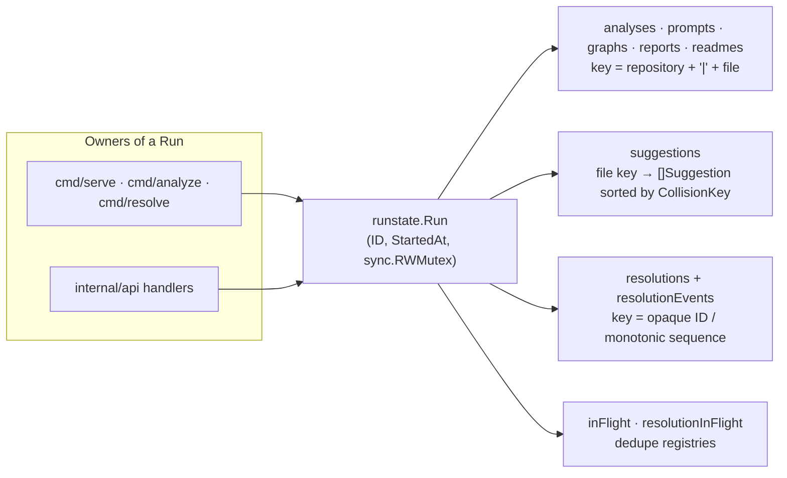

# Module: Run State

## Purpose
`runstate` owns every piece of mutable state produced by a single analysis execution. A `Run` replaces what used to be package-level globals (analysis, prompt, graph, report, suggestion and resolution caches) that leaked between executions: each run gets its own isolated maps, every per-file collection is keyed by a repository-qualified key (`repository root + "|" + relative path`) so identical relative paths in different repositories never overwrite one another, and every enumeration is returned in deterministic, sorted order. The package also provides `History`, the bounded in-memory run-history read model used by the HTTP server, and stores the resolution records plus their append-only audit events on the run itself. All access is guarded by a single `sync.RWMutex` per `Run`; there is no package-level mutable state.

## Files
### `backend/internal/runstate/runstate.go`
#### Primary Role
Defines the `Run` aggregate and the `Suggestion` record: repo-scoped storage for analyses, prompt contexts, graphs, reports, README excerpts, suggestions, and the in-flight registries that de-duplicate concurrent suggestion generation and resolution applies. Also defines the two key builders (`FileKey`, `SuggestionKey`) and the suggestion status vocabulary that the rest of the codebase (engine, suggestions, api) depends on.

#### Key Structures
- `func FileKey(repoRoot, file string) string` — the repository-safe key `repoRoot + "|" + file`; with an empty `repoRoot` (legacy callers/tests) it degrades to the plain `file` path.
- `func SuggestionKey(repoRoot, file, collisionKey string) string` — `FileKey(repoRoot, file) + "|" + collisionKey`, i.e. run-unique across `(repository, file, collision)`.
- `type Suggestion struct` — one run-scoped AI suggestion: `File`, `Collision semantic.DiffItem`, `Resolution ai.AIResolutionResponse`, plus the Phase-2 metadata `ID` (`<repository>|<file>|<collisionKey>`), `Repository`, `CollisionKey`, `Provider`, `Model`, `Revision` (incremented on regeneration, invalidating earlier resolutions/approvals), `RegionID`, `ResolutionID`, `Status`, `ErrorCode`, `Retryable`, `ErrorMessage`, `StartedAt`, `CompletedAt`. Original JSON names (`file`, `collision`, `resolution`) are unchanged; metadata is `omitempty`.
- Suggestion status constants: `StatusComplete = "complete"`, `StatusBelowThreshold = "below_threshold"` (valid but under the configured confidence threshold; still returned), `StatusFailed = "failed"`, `StatusManualReview = "manual_review"` (declared for conflicts whose region cannot be mapped). Note: the generator never assigns `StatusManualReview` to a `Suggestion` — today it expresses manual review on the linked `resolutions.Resolution` (`resolutions.StatusManualReview`) instead; suggestion `Status` is one of `complete` / `below_threshold` / `failed`.
- `type RepositoryMetadata struct { Name, CurrentBranch, IncomingBranch string }` — repository header shown by the UI.
- `type Run struct` — `ID string`, `StartedAt time.Time`, `mu sync.RWMutex`, and the private maps: `analyses map[string]promptcontext.FileAnalysis`, `prompts map[string]promptcontext.PromptContextIR`, `graphs map[string]graph.CyGraph`, `reports map[string][]byte`, `suggestions map[string][]Suggestion`, `inFlight map[string]struct{}`, `resolutions map[string]resolutions.Resolution`, `resolutionEvents []resolutions.ResolutionEvent`, `resolutionInFlight map[string]struct{}`, `eventSeq int64`, `repositoryMD RepositoryMetadata`, `validationCfg *validation.Config`, `readmes map[string]string`.
- `func NewRun() *Run` / `func NewRunWithID(id string) *Run` — constructors; an empty supplied ID is replaced by a generated one. Unexported `newRunID()` returns 8 hex bytes from `crypto/rand`, falling back to a `20060102T150405.000000000` timestamp if `crypto/rand` fails.
- Unexported helpers: `sortedKeys[V any](m map[string]V) []string` (ascending `sort.Strings`) and `matchesFile(key, file string) bool` (`key == file || strings.HasSuffix(key, "|"+file)`).
- Repo-qualified storage methods (all keyed through `FileKey`):
  - Repository header: `SetRepositoryMetadata(RepositoryMetadata)`, `GetRepositoryMetadata() RepositoryMetadata`.
  - README: `RegisterReadme(repoRoot, excerpt string)` (first write wins — idempotent so `ProcessRepository` can call it unconditionally before the worker pool), `Readme(repoRoot) (string, bool)`.
  - Analyses: `RegisterAnalysis(repoRoot, FileAnalysis)`, `GetAnalysis(repoRoot, file) (FileAnalysis, bool)`, `FindAnalysis(file) (FileAnalysis, bool)` (deterministic file-only fallback across repos), `AllAnalyses() []FileAnalysis` (sorted by key).
  - Prompt contexts: `RegisterPromptContext(repoRoot, fileName, PromptContextIR)`, `GetPromptContext`, `FindPromptContext`, `AllPromptContexts` (same three-tier pattern).
  - Graphs: `RegisterGraph(repoRoot, file, graph.CyGraph)`, `MergedGraph() graph.CyGraph`, `MergedGraphDTO() graph.GraphDTO`, `GraphKeys() []string`.
  - Reports: `SaveReport(repoRoot, fileName, jsonBytes) string` (returns the key, deep-copies in), `GetReport(repoRoot, fileName) ([]byte, bool)` (deep-copies out), `DeleteReport(repoRoot, fileName)`.
  - Suggestions: `SaveSuggestions(repoRoot, fileName, items)` (copy + stable sort by `CollisionKey`), `SaveSuggestion(repoRoot, item)` (upsert by `CollisionKey`, re-sorted), `GetSuggestions(repoRoot, fileName) ([]Suggestion, bool)` (copy out), `FindSuggestion(repoRoot, fileName, collisionKey) (Suggestion, bool)` (the dedupe lookup).
  - In-flight registry: `TryBeginSuggestion(key) bool` (false when a generation for the same run/repository/file/collision is already running; always pair with `EndSuggestion(key)`).

#### Algorithms & Logic
- **Repository-qualified keying.** Every per-file collection stores under `FileKey(repoRoot, file)`, so `/repoA|src/main.go` and `/repoB|src/main.go` coexist. `matchesFile` lets the `Find*` methods answer file-only API lookups while still walking keys in sorted order, so the match is deterministic.
- **Mutex strategy.** One `sync.RWMutex` per `Run` guards *all* collections (including the resolution/event state declared in `resolutions.go`). Mutations take the write lock, lookups take the read lock; `MergedGraph` collects the graphs under `RLock`, releases it, and only then calls `graph.MergeGraphs`, so the merge (the expensive part) never blocks writers.
- **Deterministic ordering.** `sortedKeys` is used by every enumerator; `SaveSuggestions`/`SaveSuggestion` keep each per-file list stably sorted by `CollisionKey`; merged graphs therefore come out in a registration-independent order (asserted by tests).
- **Upsert, never duplicate.** Repeated `RegisterAnalysis`/`RegisterGraph`/`SaveSuggestion` for the same identity replaces the previous entry, so re-scanning or regenerating cannot duplicate data.
- **Copy semantics.** Report bytes are copied on write and on read, `GetSuggestions` and `AllResolutionEvents` return copies, and `GetValidationConfig` returns a copy of the stored `validation.Config` — callers can never mutate run state accidentally.
- **In-flight de-duplication.** `inFlight` (suggestions) and `resolutionInFlight` (applies, shared with reverts) are `map[string]struct{}` sets: the first `TryBegin*` wins, concurrent attempts get `false`, and `defer End*` releases the slot — this is what makes concurrent duplicate requests collapse into exactly one network call / one successful apply.

#### Wiring (Dependencies)
- Imports: stdlib (`crypto/rand`, `encoding/hex`, `sort`, `strings`, `sync`, `time`) plus `CommitIssues/internal/ai` (`Suggestion.Resolution` type), `CommitIssues/internal/context` (`FileAnalysis`, `PromptContextIR`), `CommitIssues/internal/graph` (`CyGraph`, merge/DTO), `CommitIssues/internal/resolutions` (`Resolution`, `ResolutionEvent`), `CommitIssues/internal/semantic` (`DiffItem`), `CommitIssues/internal/validation` (`Config`).
- Imported by (verified with ripgrep over `backend\` for `CommitIssues/internal/runstate`): non-test — `backend/cmd/analyze.go`, `backend/cmd/resolve.go`, `backend/cmd/serve.go`, `backend/internal/api/compare.go`, `backend/internal/api/resolutions.go`, `backend/internal/api/server.go`, `backend/internal/apply/apply.go`, `backend/internal/engine/pipeline.go`, `backend/internal/suggestions/suggestions.go`. Test importers (same package path in `_test.go` files): `internal/apply/apply_test.go`, `internal/api/compare_test.go`, `internal/api/resolutions_test.go`, `internal/api/server_test.go`, `internal/engine/ai_resolution_test.go`, `internal/engine/discovery_test.go`, `internal/engine/pipeline_test.go`, `internal/suggestions/suggestions_test.go`.

### `backend/internal/runstate/history.go`
#### Primary Role
The `RunHistory` read model (one row per run + repository) and `History`, a bounded in-memory store for it. It is deliberately Phase-2-scoped: no database persistence, no package-level global — the store is created and owned by the component that starts the server (`cmd/serve`) and handed to the API server.

#### Key Structures
- `type RunHistory struct` — `RunID`, `Repository`, `StartedAt`, `CompletedAt` (zero while in progress), `FilesAnalyzed`, `FailedFiles`, `CollisionCount`, `Provider`, `Model`, `Succeeded` (JSON `successfulSuggestions`), `Failed` (`failedSuggestions`), `BelowThreshold` (`belowThresholdSuggestions`), `TimedOut`, `Cancelled`, `ErrorSummaries []string`. Carries no secrets.
- `func (h RunHistory) Key() string` — `FileKey(h.RunID, h.Repository)`, so updates are upserts on `(run, repository)`.
- `type History struct { mu sync.Mutex; entries map[string]RunHistory; max int }`.
- `const DefaultHistoryLimit = 100`; `func NewHistory(max int) *History` — a non-positive `max` falls back to `DefaultHistoryLimit`.
- `func (h *History) Record(entry RunHistory)` — upsert + eviction.
- `func (h *History) UpdateSuggestions(runID, repository string, succeeded, failed, belowThreshold int)` — merges counters; silently ignores a missing base entry.
- `func (h *History) Merge(runID, repository string, fn func(*RunHistory)) bool` — atomic read-modify-write under the history lock; returns `false` (and never invokes `fn`) when no base entry exists.
- `func (h *History) List() []RunHistory`, `func (h *History) Len() int`.

#### Algorithms & Logic
- **Bounds and eviction.** `Record` upserts first, then, if `len(entries) > max`, sorts all entries by `evictTime` (a helper: `CompletedAt` when non-zero, otherwise `StartedAt`) with a deterministic `Key()` tie-break, and deletes `len(entries) - max` of the oldest — so the store can never grow past its limit and eviction order is reproducible (no map-iteration randomness).
- **Never fabricate history.** `UpdateSuggestions` and `Merge` only touch an entry that `Record` created; suggestion generation therefore cannot invent run history for an unknown run.
- **Deterministic listing.** `List` sorts by `evictTime` ascending, then `RunID`, then `Repository` (the doc comment describes the intent as completion time first, in-progress last); every call returns the same order for the same data.

#### Wiring (Dependencies)
- Imports: stdlib only (`sort`, `sync`, `time`) — no internal dependencies.
- Imported by (verified): `backend/cmd/serve.go` (`NewHistory(runstate.DefaultHistoryLimit)` + `Record` for every analyzed repository before the server starts), `backend/internal/suggestions/suggestions.go` (`Generator.History` → `Merge`), `backend/internal/api/server.go` (`StartGraphServer`/`NewHandler` take `*runstate.History` and serve `history.List()` on `/api/history`). Test importers: `internal/suggestions/suggestions_test.go` (history counters) and this package's own `suggestions_history_test.go`.

### `backend/internal/runstate/resolutions.go`
#### Primary Role
Resolution storage on the `Run`: resolutions keyed by their opaque, URL-safe ID (each carrying its own repository qualification), an append-only sequence-ordered audit log of `resolutions.ResolutionEvent`s, the per-resolution in-flight lock used by apply/revert, and the run's validation configuration.

#### Key Structures
- `func (r *Run) SaveResolution(res resolutions.Resolution) resolutions.Resolution` — store/replace by ID; generates `resolutions.NewID()` when `res.ID == ""` and returns the stored copy so the caller persists the generated identifier.
- `func (r *Run) GetResolution(id string) (resolutions.Resolution, bool)`.
- `func (r *Run) FindResolutionBySuggestion(suggestionID string) (resolutions.Resolution, bool)` — most recent resolution for a suggestion, deterministic tie-break by `CreatedAt` then `ID`.
- `func (r *Run) ResolutionsFor(repoRoot, file string) []resolutions.Resolution` — filtered on `res.Repository == repoRoot && res.File == file`, ordered by creation time then ID.
- `func (r *Run) AllResolutions() []resolutions.Resolution` — ordered by repository, file, `CreatedAt`, then `ID`.
- `func (r *Run) RecordResolutionEvent(event resolutions.ResolutionEvent) resolutions.ResolutionEvent` — appends one immutable event, assigning the next run-wide monotonic `Sequence` (`eventSeq++`) under the write lock; a zero `Timestamp` is replaced with `time.Now().UTC()`.
- `func (r *Run) ResolutionEvents(resolutionID string) []resolutions.ResolutionEvent` (sequence order) and `func (r *Run) AllResolutionEvents() []resolutions.ResolutionEvent` (copy callers may mutate).
- In-flight apply/revert: `TryBeginResolutionApply(id) bool`, `EndResolutionApply(id)`, plus `TryBeginResolutionRevert(id)` / `EndResolutionRevert(id)` which simply reuse the same `resolutionInFlight` tracker — so a revert and an apply for one resolution cannot overlap.
- Validation config: `SetValidationConfig(cfg validation.Config)`, `GetValidationConfig() *validation.Config` (nil when unset; otherwise a copy).

#### Algorithms & Logic
- Resolution lookup is by opaque ID (never by path), while the record itself stores `Repository` + `File`, so identical relative paths in different repositories cannot collide; `FindResolutionBySuggestion` scans sorted keys and keeps the newest by `CreatedAt` with an `ID` tie-break, making revision lookups stable regardless of insertion order.
- The audit log is append-only with a single monotonic counter assigned under the run lock — event order is total and stable, and timestamps are always populated so `ResolutionEvents`/`AllResolutionEvents` are well-defined.
- Reuses the suggestion in-flight pattern (`map[string]struct{}` + `Try/End`), which is what makes concurrent applies of one resolution produce exactly one success and one `APPLY_IN_PROGRESS` (later `ALREADY_APPLIED`) response.

#### Wiring (Dependencies)
- Imports: stdlib (`sort`, `time`) plus `CommitIssues/internal/resolutions` (records and event types) and `CommitIssues/internal/validation` (`Config`).
- Imported by: the `Run` type is defined in this package, so this file adds methods only; its external consumers are the same importers as `runstate` (`internal/apply`, `internal/api/resolutions.go`, `internal/suggestions`, `internal/engine`, `cmd/*`) — verified with the same `CommitIssues/internal/runstate` search.

## Cross-Module Flow
- `cmd/serve` → `runstate.NewRun()` + `runstate.NewHistory(runstate.DefaultHistoryLimit)` → `engine.ProcessRepository(ctx, run, …)` registers analyses/graphs/README excerpts → a `RunHistory` row is `Record`ed per repository → `api.StartGraphServer(run, history, port)`; `/api/history` then serves `history.List()`.
- `cmd/resolve` → `engine.ProcessRepository(…, runAI=true)` → `engine.runAIResolution` → `run.SaveSuggestion(repoRoot, item)` with status `complete` / `below_threshold` / `failed`, and on success `run.SaveResolution(…)` (`StatusProposed`) → `item.ResolutionID = savedRes.ID`.
- `GET /api/suggestions` → `internal/api.handleSuggestions` → `suggestions.Generator` → `run.FindSuggestion` / `run.TryBeginSuggestion` / `run.SaveSuggestion`, plus `run.SaveResolution` + `run.RecordResolutionEvent`; `Generator.History` → `History.Merge` updates the counters consumed by `GET /api/history`.
- Regenerating a suggestion (`suggestions.resolveOne`) → `run.FindResolutionBySuggestion(prior.ID)` → prior resolution moved to `StatusStale` + `ApprovalExpired` with an `EventStale` audit record (unless already `applied`/`reverted`).
- Preview/approve/apply/revert handlers (`internal/api/resolutions.go`) → `run.GetResolution` / `run.SaveResolution` / `run.RecordResolutionEvent` / `run.TryBeginResolutionApply` → `apply.Apply` / `apply.Rollback`, which read `run.GetValidationConfig()` for post-apply validation.
- The engine pipeline (both CLI and server paths) uses `run.RegisterReadme(repoRoot, …)` once per repository before its worker pool, and every worker reads the excerpt back through `run.Readme(repoRoot)`.

## Tests
- `backend/internal/runstate/runstate_test.go` — unique/non-empty run IDs, `NewRunWithID` ID handling, repeated analysis and graph registration never duplicate, sorted analysis and merged-graph output, run-to-run isolation (no leaked analyses/graphs), repository-scoped and deletable reports, and race safety of 50 concurrent registrations.
- `backend/internal/runstate/isolation_test.go` — `FileKey` repository scoping (`repoA|src/main.go` ≠ `repoB|src/main.go`), identical relative paths in two repositories stored separately for analyses/prompt contexts/graphs/suggestions/metadata, merged-graph node ID safety across repositories, and merged-graph determinism independent of registration order.
- `backend/internal/runstate/suggestions_history_test.go` — `SaveSuggestion` upsert-by-collision-key with stable ordering, `FindSuggestion` scoping, `TryBeginSuggestion` exclusivity/releasability and run-scoping, concurrent suggestion writes are race-safe, `History` bounded eviction (limit 3 keeps the three newest), deterministic `List` ordering, upsert + `Merge` semantics (missing entries ignored, untouched fields preserved), `NewHistory` default-limit fallback, and `SuggestionKey` shape/collisions.
- `backend/internal/runstate/resolutions_test.go` — save/get resolutions, generated IDs for empty input, upsert without duplicates, most-recent-by-suggestion lookup, repository/file scoping of `ResolutionsFor`, deterministic `AllResolutions` ordering with ID tie-break, monotonic non-decreasing event sequences with populated timestamps, per-resolution event filtering, `AllResolutionEvents` returning a copy, apply in-flight exclusivity and run scoping, run-to-run resolution/event isolation, and 40-goroutine race safety.
