# Module: Suggestions

## Purpose
`suggestions` generates and stores run-scoped AI resolution suggestions for the conflicts already analyzed into a `runstate.Run`. It is the server-side suggestion service behind `GET /api/suggestions` (and the analysis-refresh handler): provider/model come exclusively from the shared `ai.Config`, every AI call is request-scoped (context cancellation and timeouts are honored, never replaced with `context.Background()`), concurrency is bounded and no lock is ever held during network I/O, collision ordering is deterministic regardless of worker completion order, successes survive sibling failures, and duplicate requests for the same `(run, repository, file, collision)` identity are prevented. The package is stateless by design — all mutable state lives in the supplied `runstate.Run` (and optionally a `runstate.History`).

## Files
### `backend/internal/suggestions/suggestions.go`
#### Primary Role
Implements the bounded-concurrency generation engine: health-check the provider, build a deterministic work plan (reusing already-successful suggestions), fan the remaining collisions out to a semaphore-bounded worker pool with per-collision in-flight de-duplication, wrap every outcome in a metadata-complete `runstate.Suggestion`, create the corresponding `resolutions.Resolution` for usable results, assemble the response deterministically, and merge counters into run history.

#### Key Structures
- `const DefaultMaxConcurrency = 4` — used when `Generator.MaxConcurrency <= 0`.
- `type Meta struct` — pass summary returned as API response metadata: `Provider`, `Model`, `RunID`, `Generated`, `Reused`, `Deduped`, `Failed`, `BelowThreshold`, `Retryable`, `Failures []Failure`, plus `Config ai.Config` and `Err *ai.Error`, both `json:"-"` (never serialized — no secrets).
- `type Failure struct` — one structured per-collision failure: `File`, `CollisionKey`, `Code`, `Message`, `Retryable`.
- `type Result struct { Suggestions []runstate.Suggestion; Meta Meta }`.
- `type Generator struct` — the options:
  - `Cfg ai.Config` — shared AI configuration (assembled by callers as flags > env > provider defaults).
  - `MaxConcurrency int` — bound on simultaneous AI requests; `<= 0` → `DefaultMaxConcurrency` (via unexported `limit()`).
  - `History *runstate.History` — optional; when non-nil, suggestion counters are merged into the run's history entries.
- `func (g *Generator) GenerateForFile(ctx context.Context, run *runstate.Run, repoRoot, file string) (Result, error)` — single-file pass; with an explicit `repoRoot` it looks the analysis up exactly, otherwise falls back to the deterministic file-only `run.FindAnalysis`, and an empty `repoRoot` is filled from `analysis.Repository`.
- `func (g *Generator) GenerateForRun(ctx context.Context, run *runstate.Run) (Result, error)` — every collision of every analysis of the run (`run.AllAnalyses()`); returns `errors.New("no analysis available to generate suggestions")` for a nil or empty run.
- `func (g *Generator) generate(ctx, run, analyses, singleRepo, singleFile) (Result, error)` — the shared five-phase engine (see below).
- `func (g *Generator) resolveOne(ctx, run, resolver, analysis, collision, key) runstate.Suggestion` — one validated, retried AI call wrapped with metadata; it never panics, never blocks on a lock and always records a status.
- `func (g *Generator) recordHistory(ctx, run, analyses, meta)` plus helpers `countCollisions`, `repoSuggestions`.
- Unexported helpers: `collisionKey(collision semantic.DiffItem) string` (delegates to `semantic.DiffKey` — precise symbol identity when available, legacy `kind:name` fallback), `compareString`, `sortedFailures` (stable sort by file, then collision key).

#### Algorithms & Logic
`generate` runs five phases:
1. **Provider health check first.** `ai.GetResolver(g.Cfg)` then `ai.CheckProvider(ctx, g.Cfg, nil)`; any error is stored in `meta.Err` and returned with `Result{Meta}` — the pass aborts *before* any generation and no suggestion is stored (typed, actionable, secret-free).
2. **Deterministic work plan + reuse.** For each analysis, for each `analysis.SmartDiff.Collisions` entry, compute the stable `collisionKey`; a previously stored suggestion with `StatusComplete` or `StatusBelowThreshold` is reused as-is (`meta.Reused++`, and its `ResolutionID` is back-filled from `run.FindResolutionBySuggestion(stored.ID)` when empty), so a second pass issues zero new requests. Anything else (typically `failed`) becomes a task, which is how retry regenerates only the failures.
3. **Bounded fan-out with cancellation and de-duplication.** One goroutine per task; each first selects on `sem <- struct{}{}` (buffered to `limit()`) versus `<-ctx.Done()`, so a cancelled pass abandons queued work instead of blocking. Inside the worker, `run.TryBeginSuggestion(SuggestionKey(repo, file, key))` provides duplicate-request prevention — a refused acquire increments `meta.Deduped` and returns; a second check of `run.FindSuggestion` catches collisions completed by another pass meanwhile (then reused). The worker calls `resolveOne`, persists with `run.SaveSuggestion`, and updates `Meta` under a small mutex that is **never held during network I/O**.
4. **Typed failure isolation.** `resolveOne` never returns an error: failures become `StatusFailed` suggestions carrying `ErrorCode`, `Retryable` and `ErrorMessage` (a `ctx.Err()` takes precedence when the request itself is cancelled), and each is appended to `meta.Failures` — so one collision failing never aborts the run or discards its siblings' successes.
5. **Deterministic assembly + history.** Reused and generated items are concatenated, filtered to the requested file/repository when `singleFile != ""`, and `sort.SliceStable`-ed by `Repository`, then `File`, then `CollisionKey`; `meta.Failures` is sorted by file/collision key; finally, if `g.History != nil`, `recordHistory` merges counters.

Status handling in `resolveOne`:
- **Revision and staleness** — `revision = prior.Revision + 1` (or `2` when the stored prior has no revision) whenever a suggestion for the same `(repo, file, key)` already exists; the prior resolution is then moved to `StatusStale` with `ApprovalStatus = ApprovalExpired` and an `EventStale` audit event (actor `system`), unless it is already `applied`/`reverted`.
- **Region mapping** — `git.MatchConflictRegion(analysis.ConflictRegions, collision.Line, OurContent, TheirContent, BaseContent)` yields `RegionID = fmt.Sprintf("%d", region.Index)` (empty when unmapped).
- **`complete` vs `below_threshold`** — `ai.ResolveCollisionWithRetry` success sets `StatusComplete`, downgraded to `StatusBelowThreshold` when `res.Confidence < g.Cfg.ConfidenceThreshold` (still returned and counted in `Meta.BelowThreshold`).
- **`failed`** — `ai.AsError(err)` supplies the typed `ErrorCode`/`Retryable`/redacted message; `StatusFailed` is the initial status of the item so a panic-free early return still yields a status.
- **`manual_review`** — expressed on the created resolution, not the suggestion: the `resolutions.Resolution` starts as `StatusProposed`, but becomes `StatusManualReview` when `!parser.IsSupportedLanguage(analysis.File)` or no conflict region matched (`!hasRegion || regionID == ""`). The runstate constant `runstate.StatusManualReview` exists but no code path assigns it to a `Suggestion` today.
- **Resolution creation** — for `complete`/`below_threshold` results a `resolutions.Resolution` is built (ID via `resolutions.NewID()`, `SuggestionID = item.ID`, region lines, `ContentHash`/`ContextHash` from the analysis, `Base`/`Ours`/`Theirs` from the region, `Replacement = item.Resolution.SuggestedCode`, `ApprovalNone`, `ValidationNotRun`) and saved with `run.SaveResolution`; `item.ResolutionID = savedRes.ID`.

```mermaid
flowchart LR
  IN["GenerateForFile / GenerateForRun"] --> H["ai.GetResolver + ai.CheckProvider<br/>(abort → typed Meta.Err)"]
  H --> P["work plan<br/>reuse complete / below_threshold"]
  P --> W["bounded workers<br/>sem = limit(), ctx-aware"]
  W --> D["run.TryBeginSuggestion<br/>(dedupe)"]
  D --> O["resolveOne → ai.ResolveCollisionWithRetry<br/>(never returns an error)"]
  O --> S["run.SaveSuggestion<br/>run.SaveResolution (proposed | manual_review)"]
  S --> A["sorted assembly<br/>(repository, file, collisionKey)"]
  A --> HIST["History.Merge<br/>(optional)"]
```

`recordHistory(ctx, run, analyses, meta)` classifies `ctx.Err()` into `TimedOut` (`DeadlineExceeded`) / `Cancelled` (`Canceled`), then for each distinct repository touched (deduped with a `seen` set) calls `History.Merge` — which refuses to fabricate an entry when no base `RunHistory` exists — recomputing `Succeeded`/`Failed`/`BelowThreshold` from the stored suggestions, refreshing `CollisionCount`, `Provider`, `Model`, and merging sorted `ErrorSummaries` (`"<code>: <message>"`).

#### Wiring (Dependencies)
- Imports: stdlib (`context`, `errors`, `fmt`, `sort`, `sync`, `time`) plus `CommitIssues/internal/ai` (Config/Resolver/health/retry/typed errors), `CommitIssues/internal/context` (`FileAnalysis`, `PromptContextIR`), `CommitIssues/internal/git` (`MatchConflictRegion`), `CommitIssues/internal/parser` (`IsSupportedLanguage`), `CommitIssues/internal/resolutions` (record creation, stale event), `CommitIssues/internal/runstate` (`Run`, `Suggestion`, `History`), `CommitIssues/internal/semantic` (`DiffItem`, `DiffKey`).
- Imported by (verified with ripgrep for `CommitIssues/internal/suggestions`): `backend/internal/api/server.go` (`handleSuggestions` builds `&suggestions.Generator{Cfg: ai.ConfigFromEnv(), History: history}` and picks `GenerateForFile` when `?file=` is present, else `GenerateForRun`) and `backend/internal/api/resolutions.go` (the analysis-refresh handler builds `&suggestions.Generator{Cfg: ai.ConfigFromEnv()}` — no `History` — after re-running `engine.ProcessConflictFile`). No test importer outside the package (`suggestions_test.go` is in-package).

## Cross-Module Flow
- `GET /api/suggestions` → `internal/api.handleSuggestions` (uses `r.Context()`, so client disconnects cancel generation) → `suggestions.Generator.GenerateForFile` / `GenerateForRun` → `run.FindSuggestion`/`TryBeginSuggestion` → `resolveOne` → `ai.ResolveCollisionWithRetry` → `run.SaveSuggestion` → `Result{Suggestions, Meta}` returned as `data` + `meta` JSON.
- Successful suggestion → `run.SaveResolution` (`StatusProposed` or `StatusManualReview`) → linked back through `item.ResolutionID`; `internal/patch`, `internal/safeguard` and `internal/apply` later consume that `resolutions.Resolution` for preview/approve/apply.
- Regeneration (a `failed`/superseded collision generated again) → `run.FindResolutionBySuggestion(prior.ID)` → prior resolution `StatusStale` + `ApprovalExpired` + `run.RecordResolutionEvent(EventStale)`; `Revision` increments so `safeguard.VerifyRevision` rejects old approvals.
- Pass completion → `Generator.recordHistory` → `runstate.History.Merge(run.ID, repo, …)` → `GET /api/history` (served by `internal/api/server.go` from `history.List()`).
- Analysis refresh (`internal/api/resolutions.go`) → `engine.ProcessConflictFile` re-analyzes the file in the same `runstate.Run`, then a `Generator` regenerates suggestions for that file only — stale resolutions are marked first so nothing old stays applicable.
- Note: the CLI `resolve` path does **not** go through this package — `engine.runAIResolution` writes `runstate.Suggestion` records (same `complete`/`below_threshold`/`failed` statuses) and its own `resolutions.Resolution` records directly.

## Tests
- `backend/internal/suggestions/suggestions_test.go` — a configurable `fakeOllama` httptest server (OpenAI-compatible `/v1/chat/completions` plus the Ollama `/api/tags` health endpoint, tracking request and in-flight counts) backs all cases:
  - `TestGenerateForFile_SuccessAndMetadata` / `TestGenerateForFile_DeterministicOrdering` / `TestGenerateForRun_OrdersAcrossFilesAndRepos` — complete statuses, full metadata (provider/model/ID/repository/timestamps), and stable collision-, file- and repository-ordered output across repeated runs.
  - `TestGenerate_BoundedConcurrency` — observed in-flight requests never exceed `MaxConcurrency`.
  - `TestGenerate_PartialFailurePreservesSuccesses` / `TestGenerate_NonRetryableFailureFlaggedNotRetryable` — one 503 collision fails with `ai.CodeHTTPError` + `Retryable` while its siblings succeed; a 400 is not retryable; `Meta.Failures` is structured.
  - `TestGenerate_ReusesStoredSuggestions` / `TestGenerate_RetryAfterFailureOnlyRegeneratesFailures` — second pass issues zero requests (`Meta.Reused`), retry re-requests only the failed collision.
  - `TestGenerate_DuplicateRequestPrevention` — four concurrent passes over two collisions produce exactly two provider requests.
  - `TestGenerate_RunAndRepositoryIsolation` — same relative path in two repos/two runs keeps separate stored suggestions.
  - `TestGenerate_BelowThresholdStatus` / `TestGenerate_ProviderUnavailableFailsBeforeGeneration` / `TestGenerate_CancellationStopsWork` / `TestGenerate_NoAnalysisIsAnError` — threshold status + `Meta.BelowThreshold`; unreachable provider returns `ai.CodeProviderUnavailable` with nothing stored; cancellation leaks no in-flight registration; empty run/missing file are errors.
  - `TestGenerate_RecordsHistory` / `TestGenerate_UnknownAnalysisHistoryEntryIgnored` — counters merged into an existing `RunHistory`; a missing base entry is never fabricated.
  - `TestGenerate_UnresolvedRegionMapping_SetsManualReview` / `TestGenerate_UnsupportedLanguage_SetsManualReview` — the created resolution is `resolutions.StatusManualReview` (unmapped region, and `.xyz` file) rather than `StatusProposed`.
